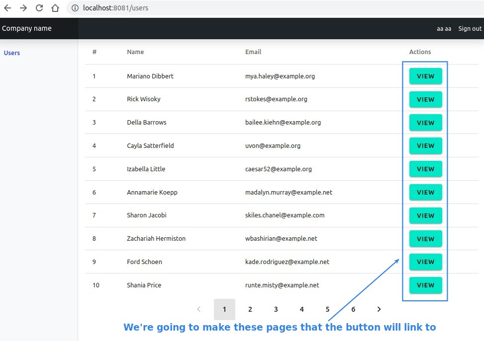
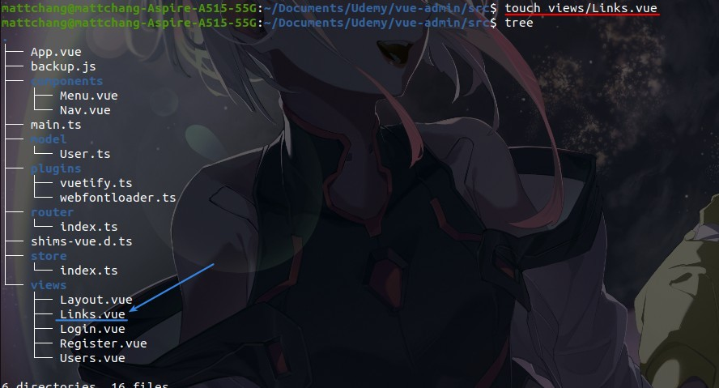
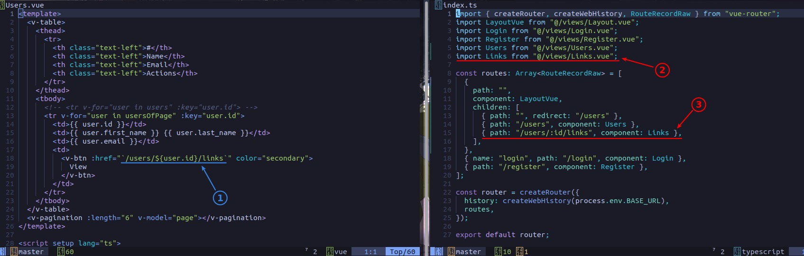
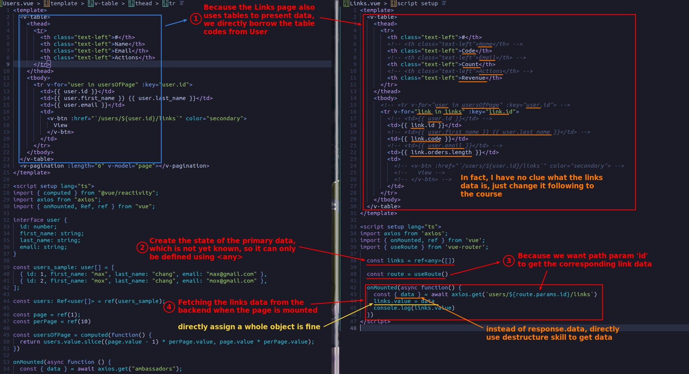
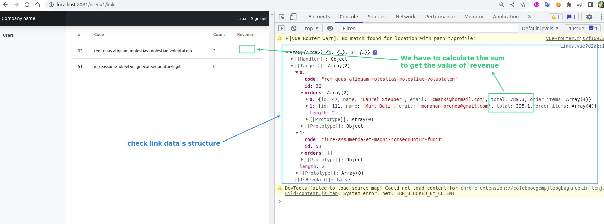
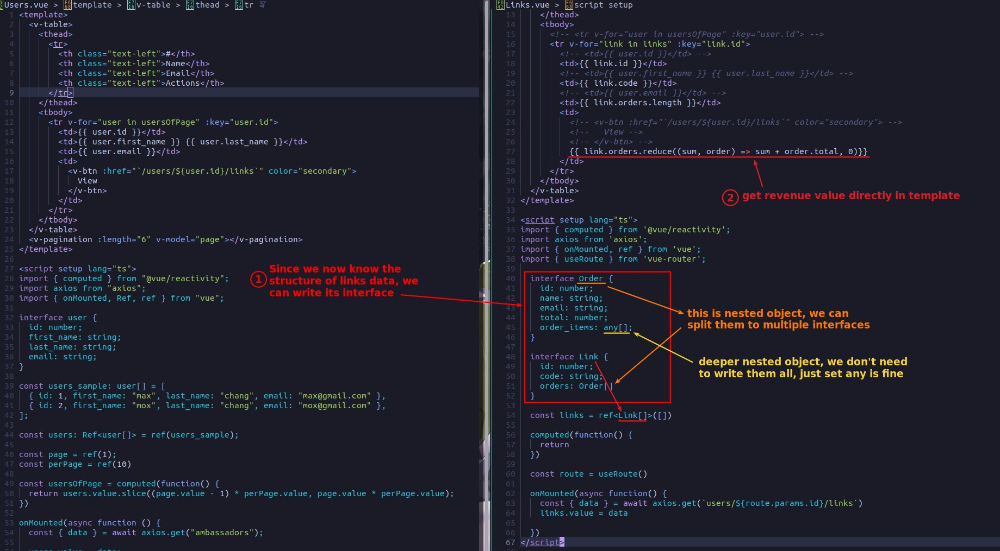
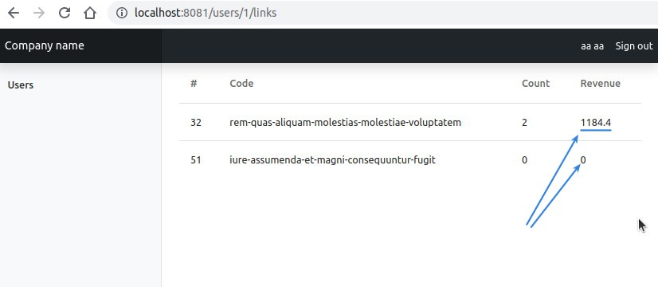

## **Goal**

## **Create Page & Sub-route setting**

## **Template, Data and Fetch onMounted**

- The backend uses the API path parameter to provide the corresponding data based on the user id, which is a useful skill.

## **Set interfaces and get Revenue**

- The part of (2) must handle the 'link' in 'link in links', so even if it's a bit complicated, it can't be handled by computed in the script

