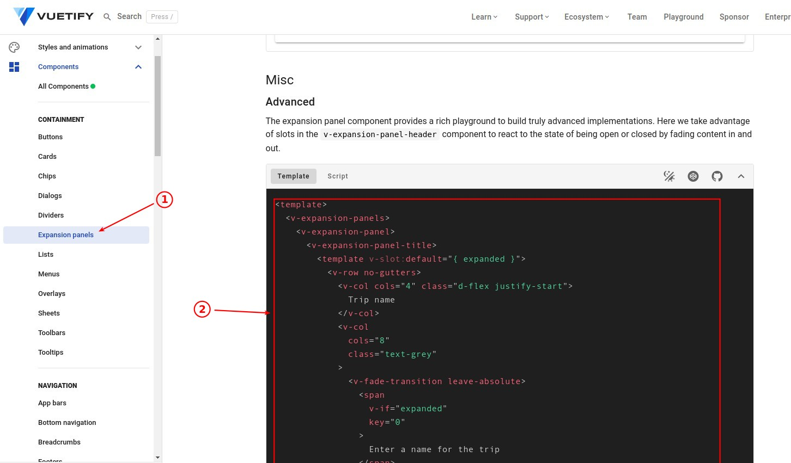
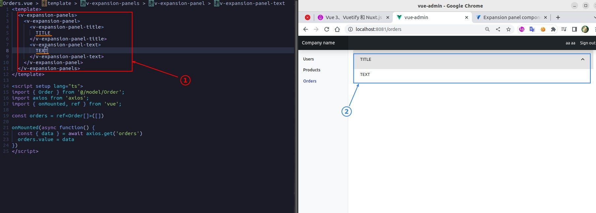
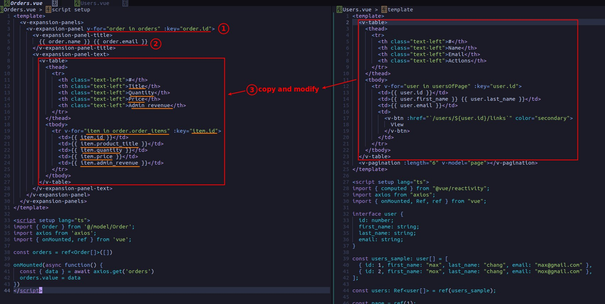

## **Create/Setup Orders page**

### _create file_

### _register route_

### _navigation_

### _result_

## **Build Orders data**

### _load orders data on mounted_

### _interfaces_

### _state_

## **Template**

### _vuetify expension comp_

### _coding_

### _result_

