## **Review /profile**

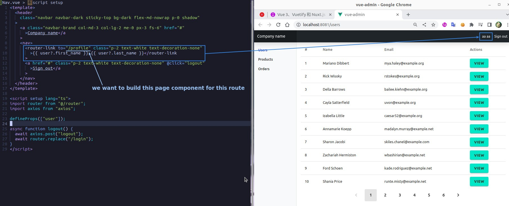

## **Create Profile page**

### _create file/register it_

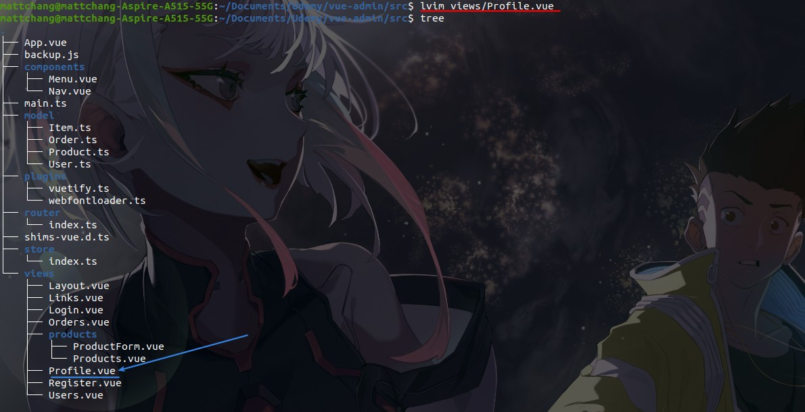

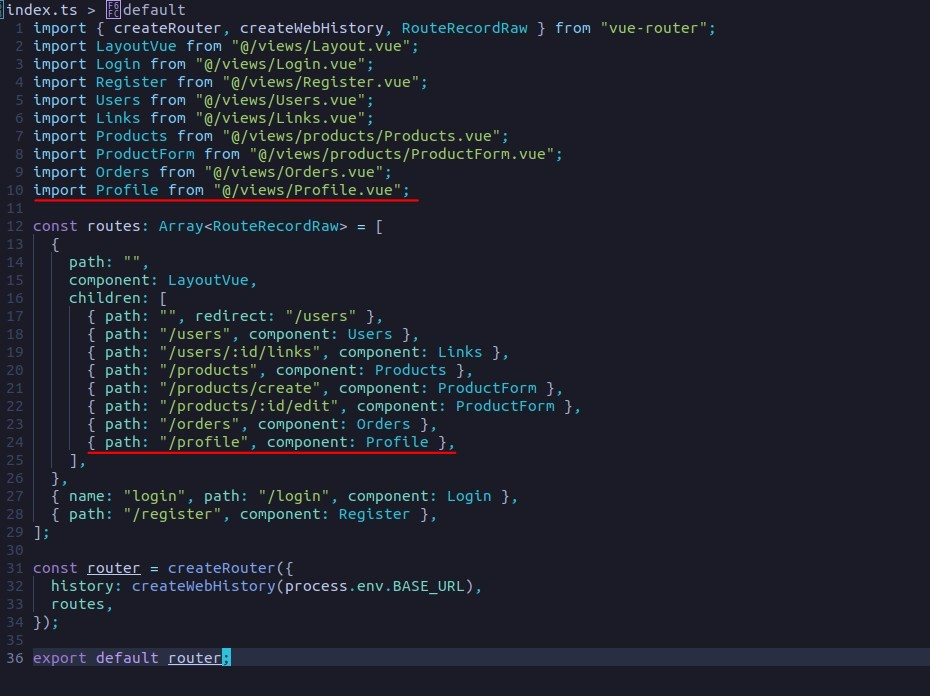

### _fetch data on mounted & set state_

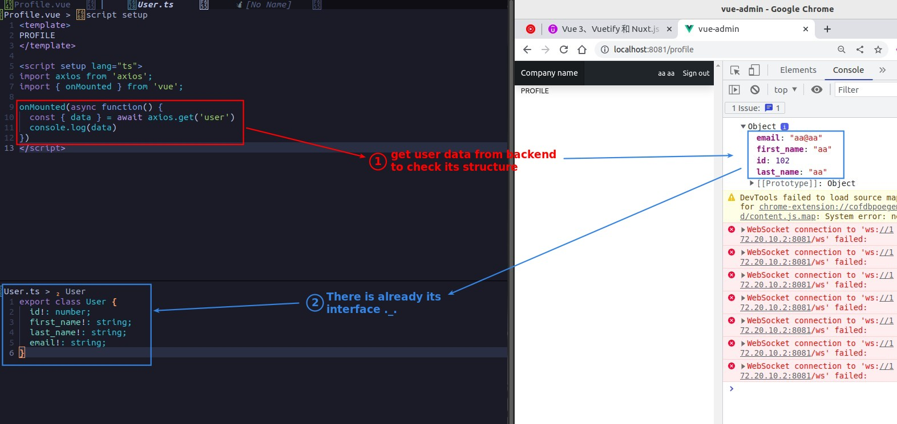

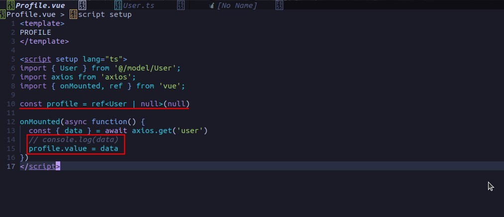

### _template_

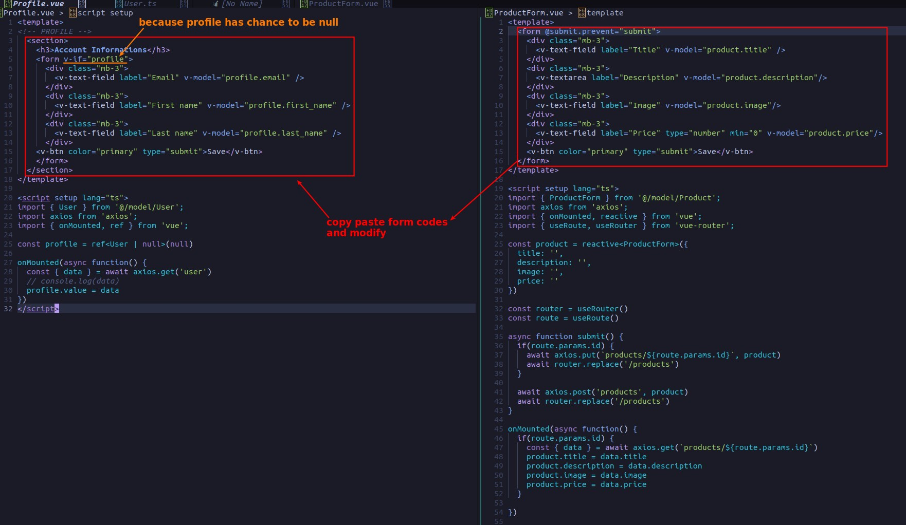

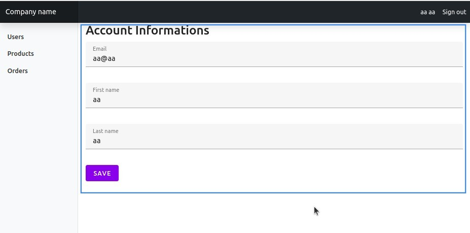

### _submit_

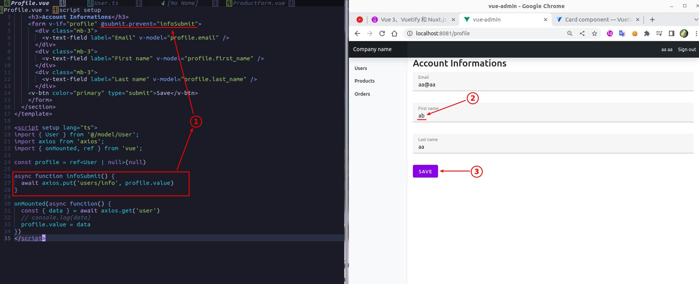

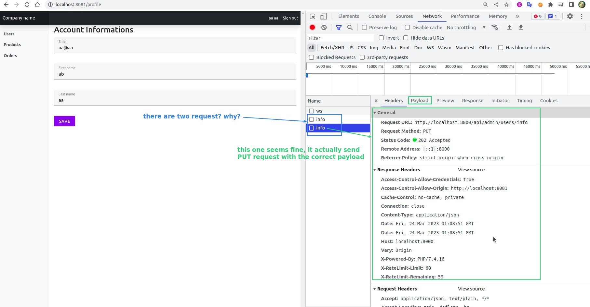

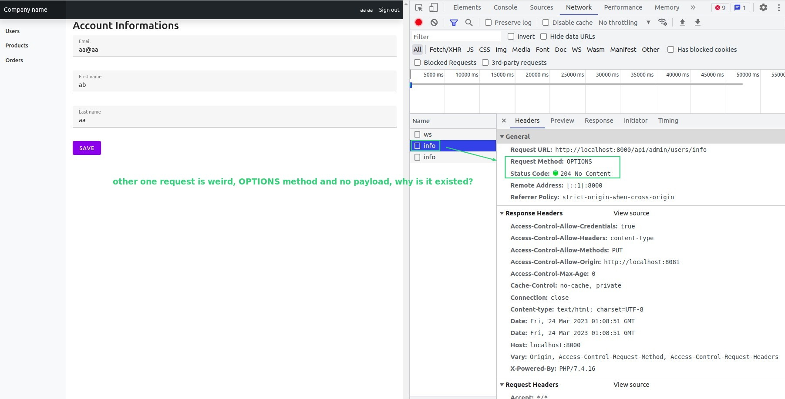

## **Password change**

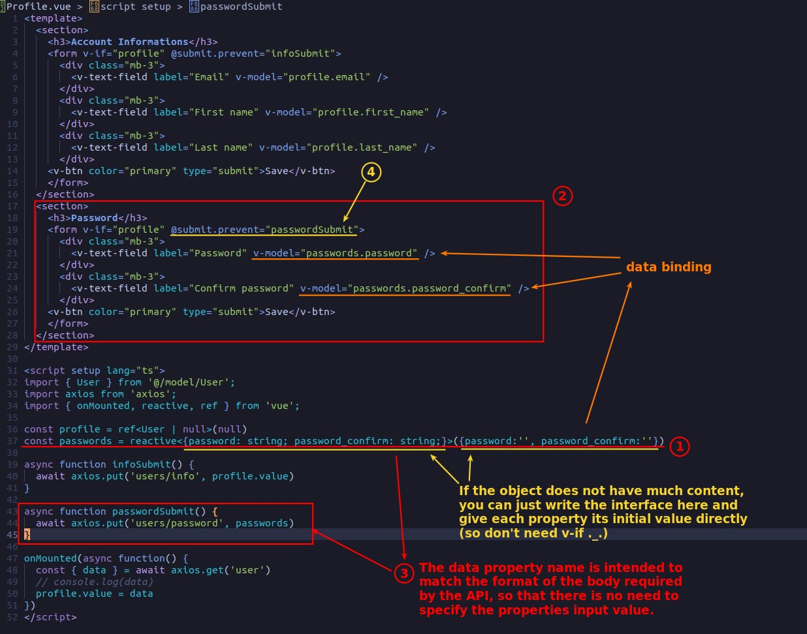

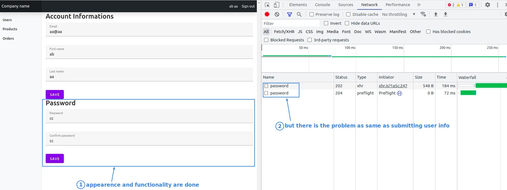
