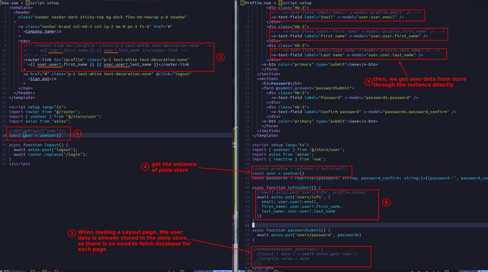

## **Install/Register Pinia**

## **Setting Pina Store and Fectching data into it**

- Even if the Layout page does not use the data in the pinia store, as the root page, it can still do the work of fetching data into the pinia store, so that the operation of loading data and retrieving data can be separated in different components.

## **Access data from Pina Store**

- Data taken directly from pinia is not reactive, so be careful with this.
  - If I use getter, is it reactive?
