## **Boostrap**

### _CSS install_

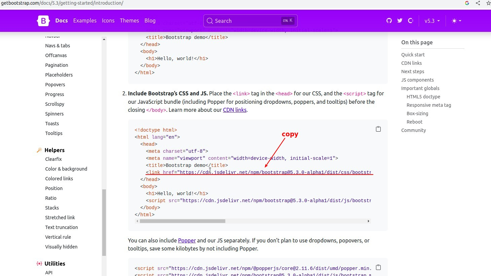

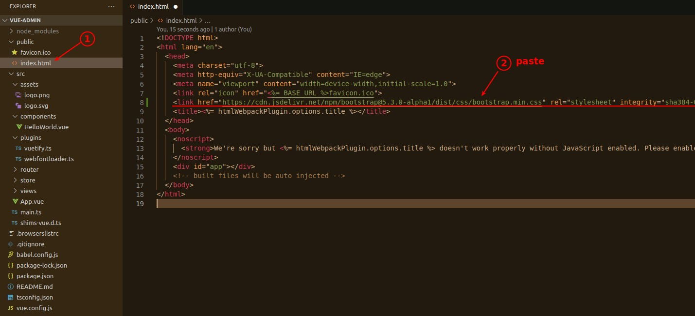

### _Delete useless things_

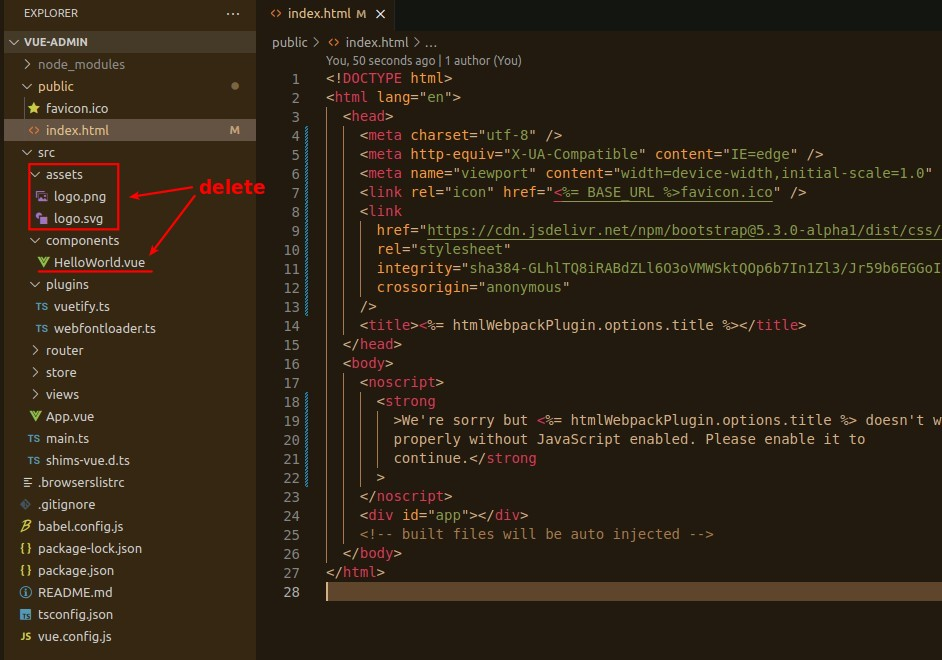

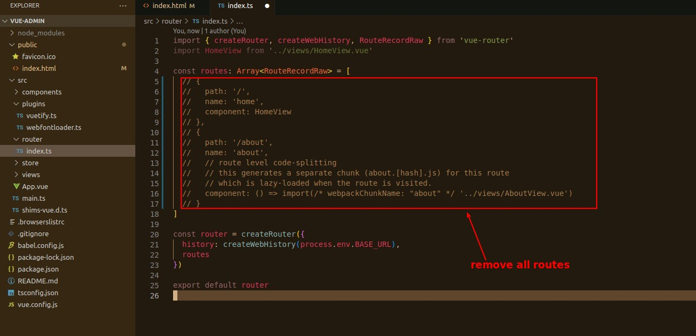

### _Copy paste source codes of example_

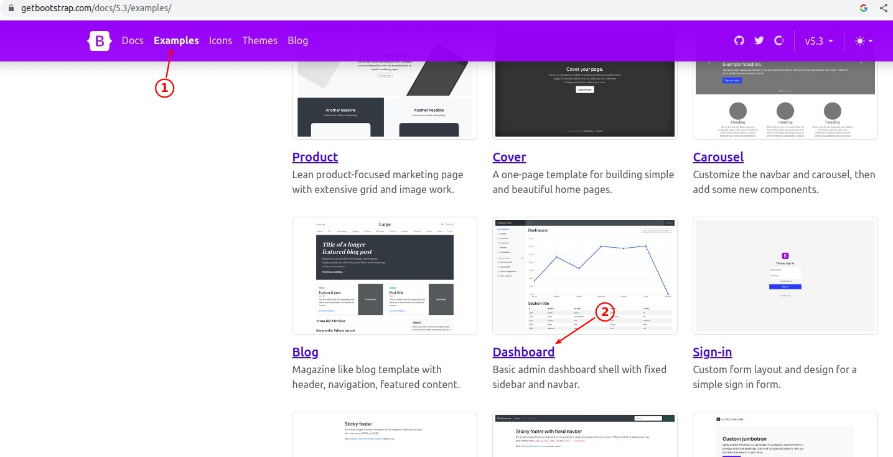

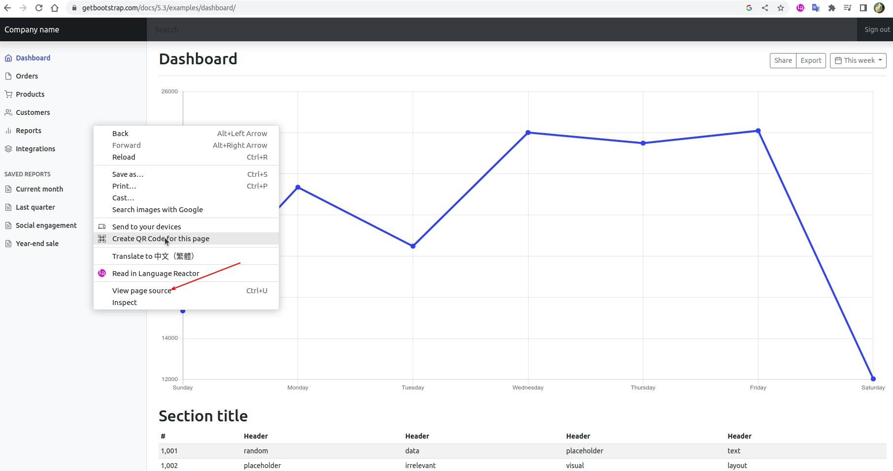

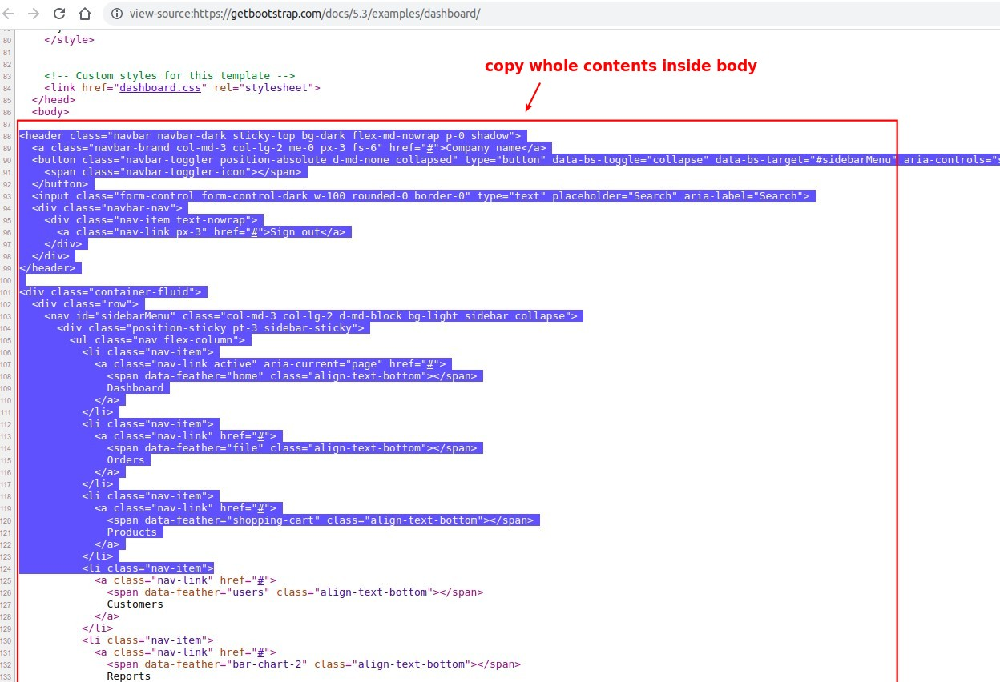

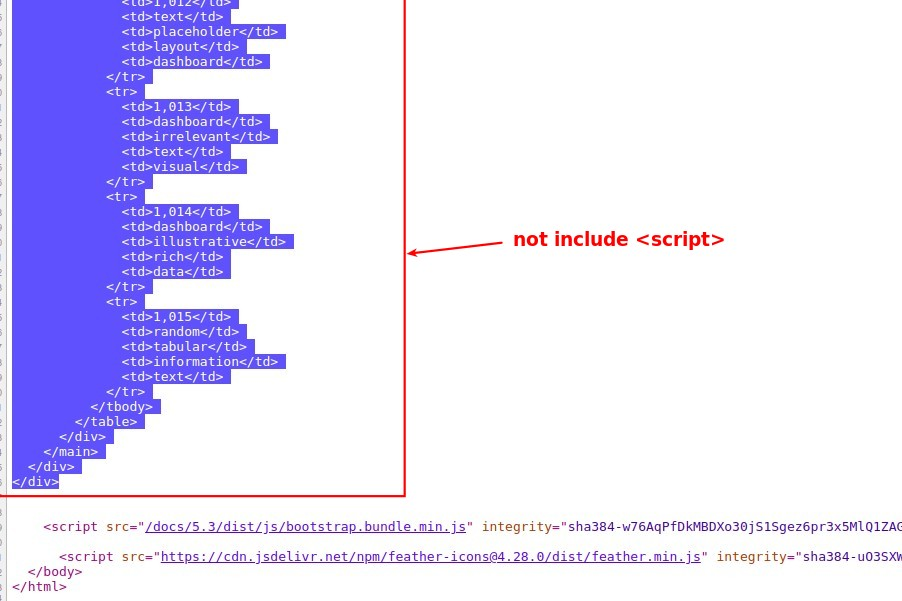

## **Vue - App.vue**

### _Modify HTML codes_

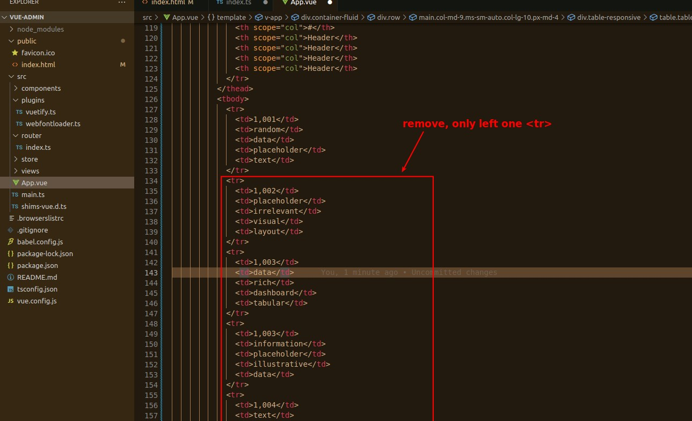

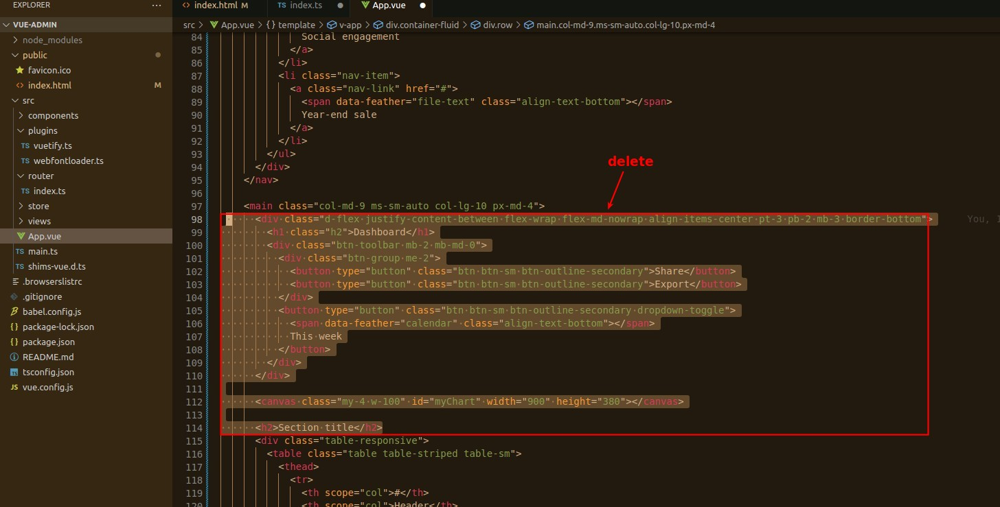

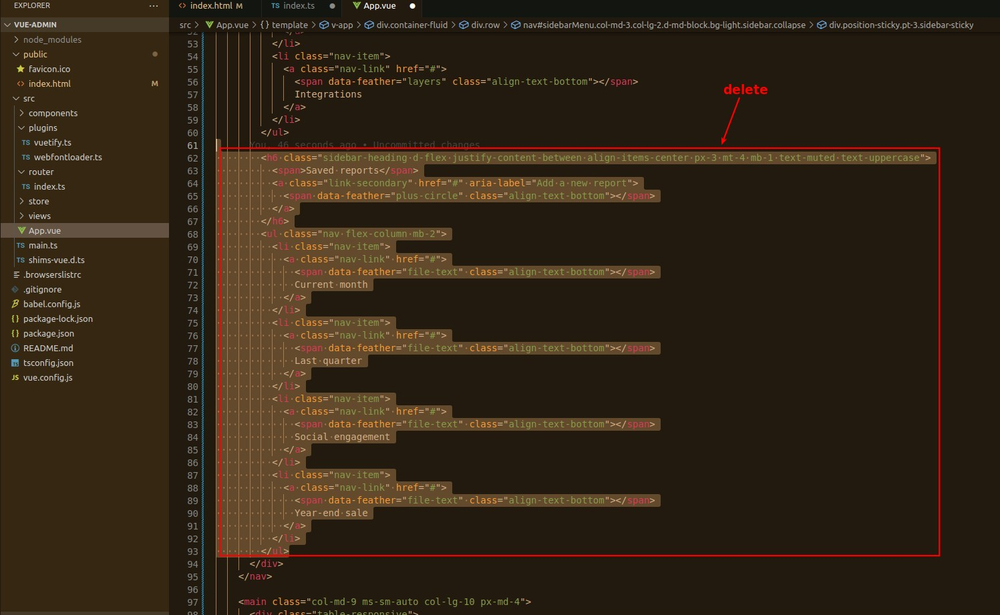

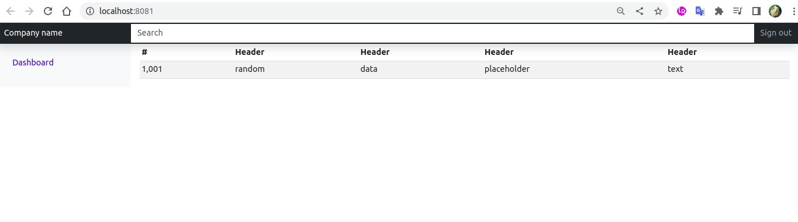

### _Copy paste CSS styling_

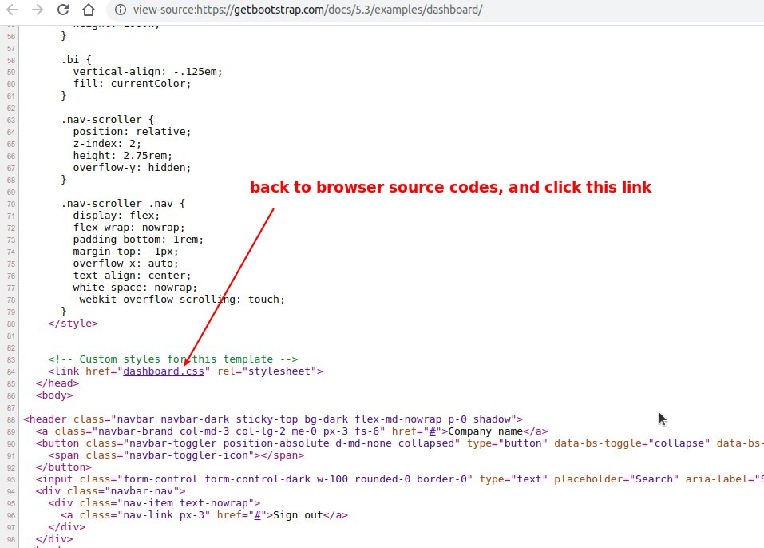

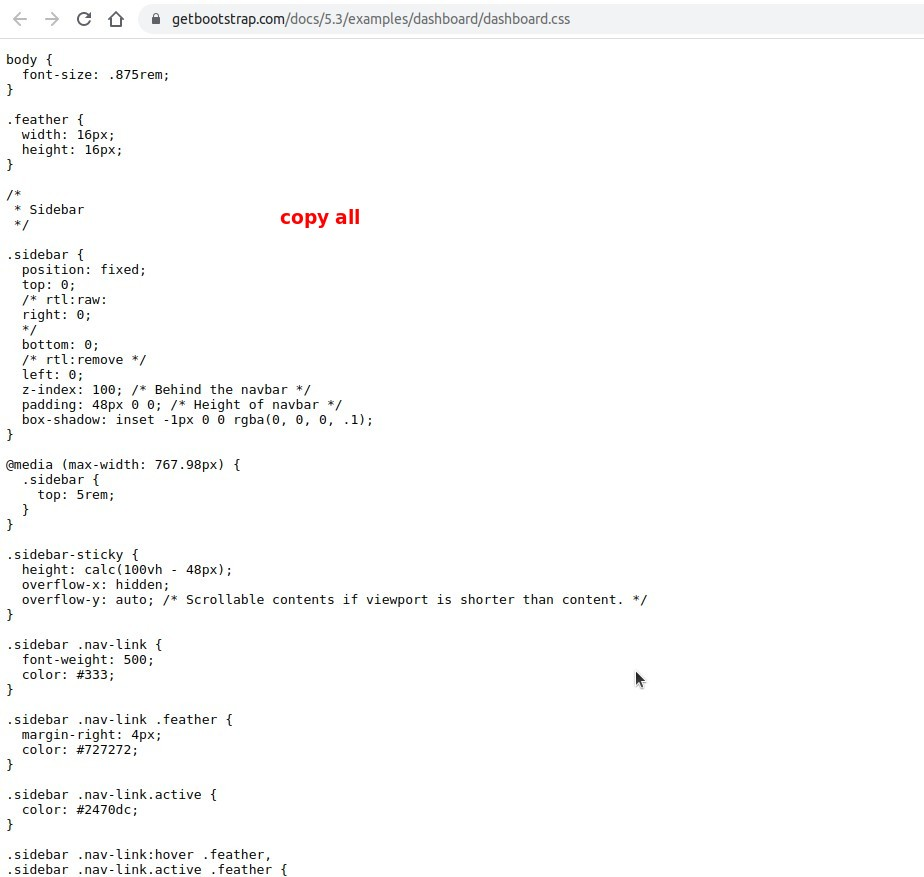

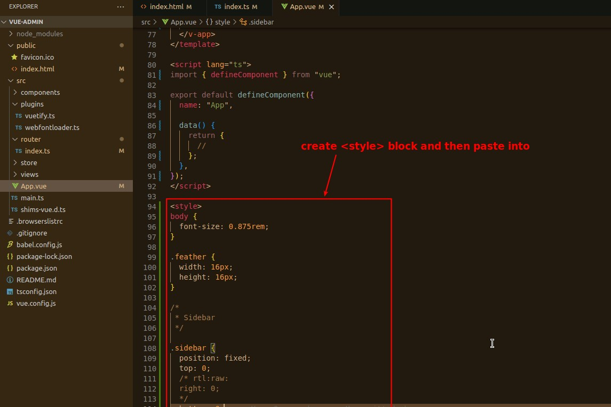

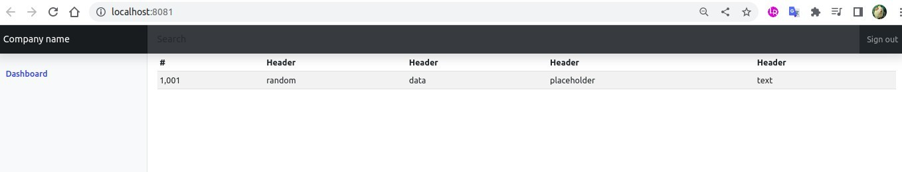

### _Outsrouce to new components_

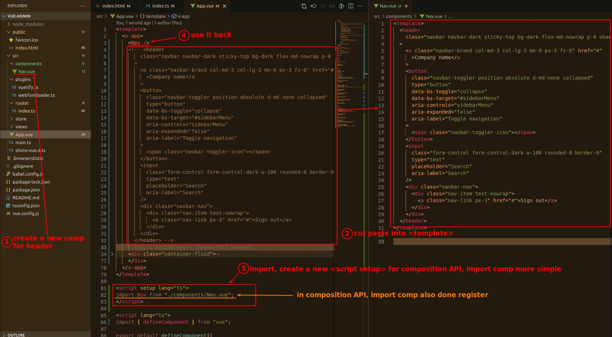

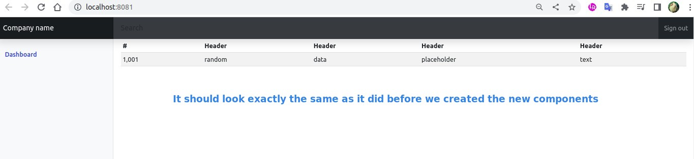
