## **Page Component: Layout**

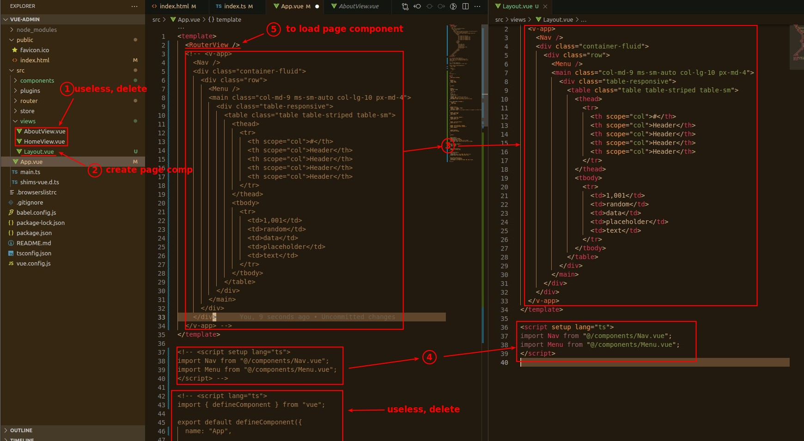

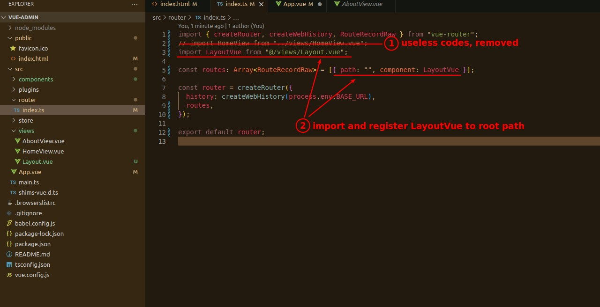

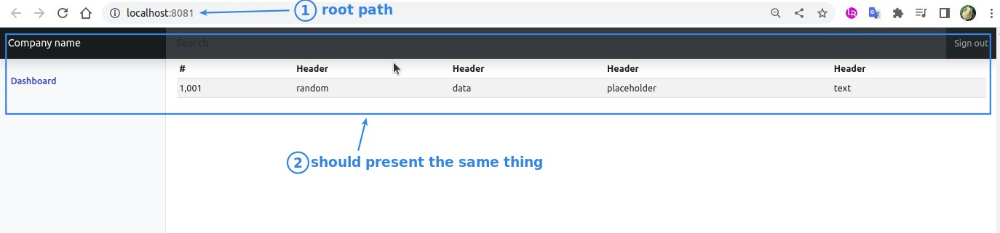

## **Two More Page Components**

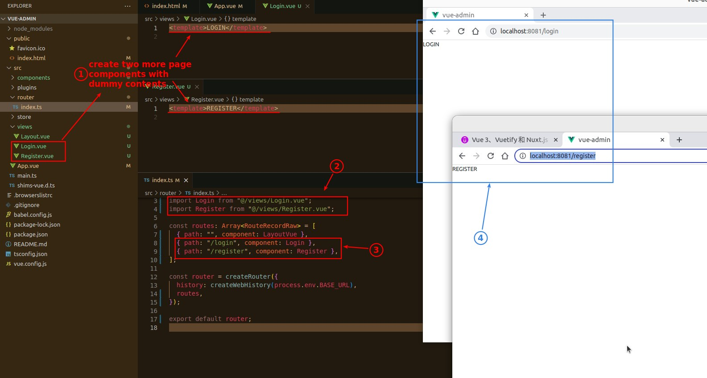

### _Copy HTML from Bootstrap_

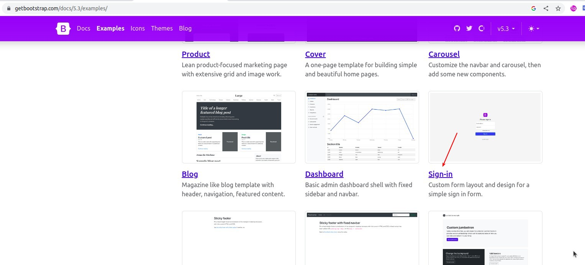

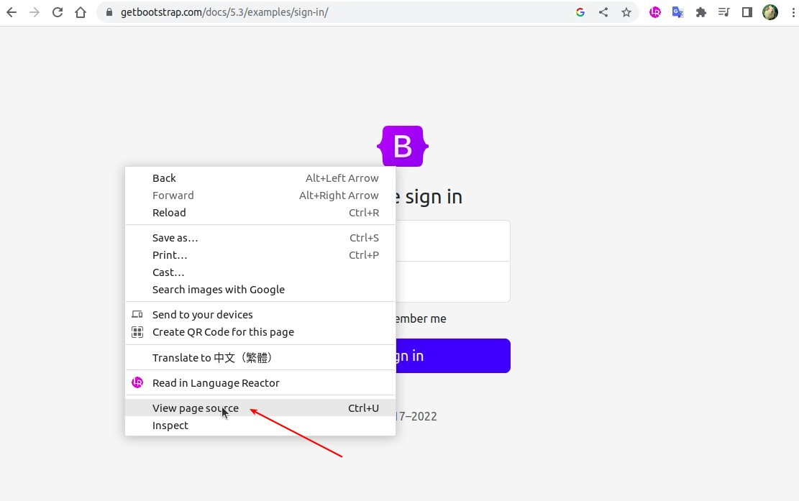

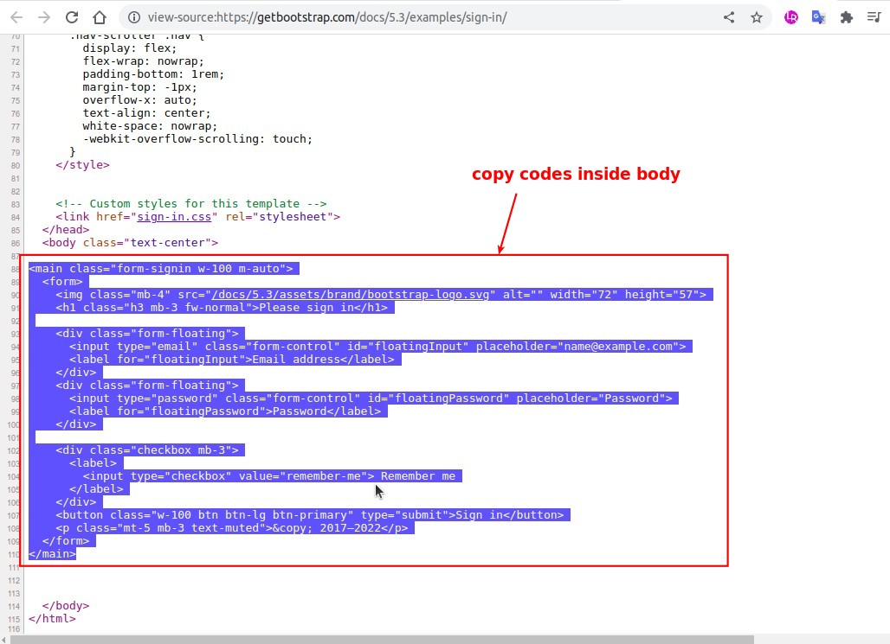

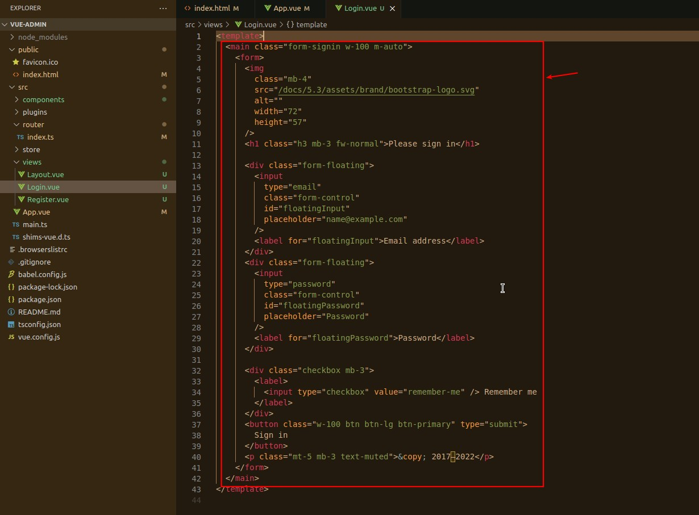

### _Copy Styling from Bootstrap_

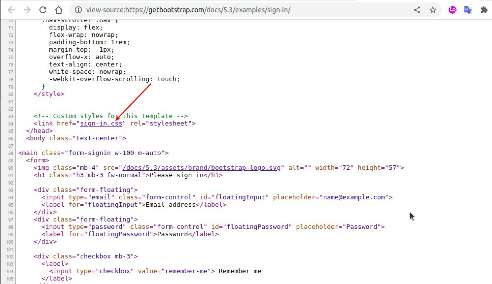

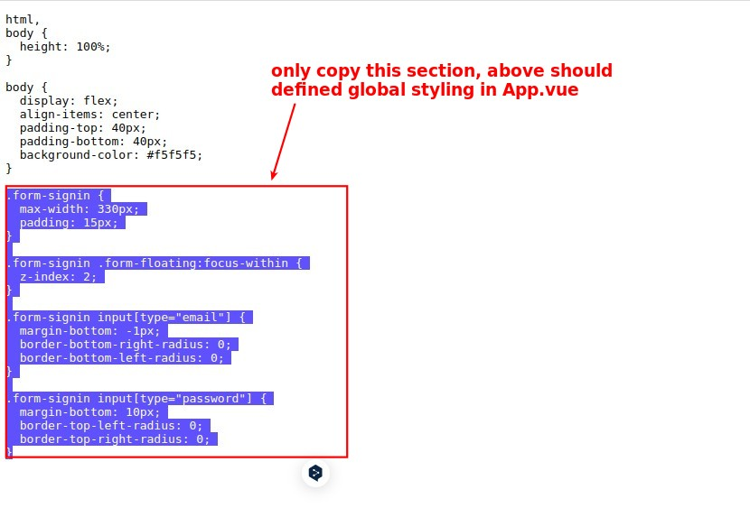

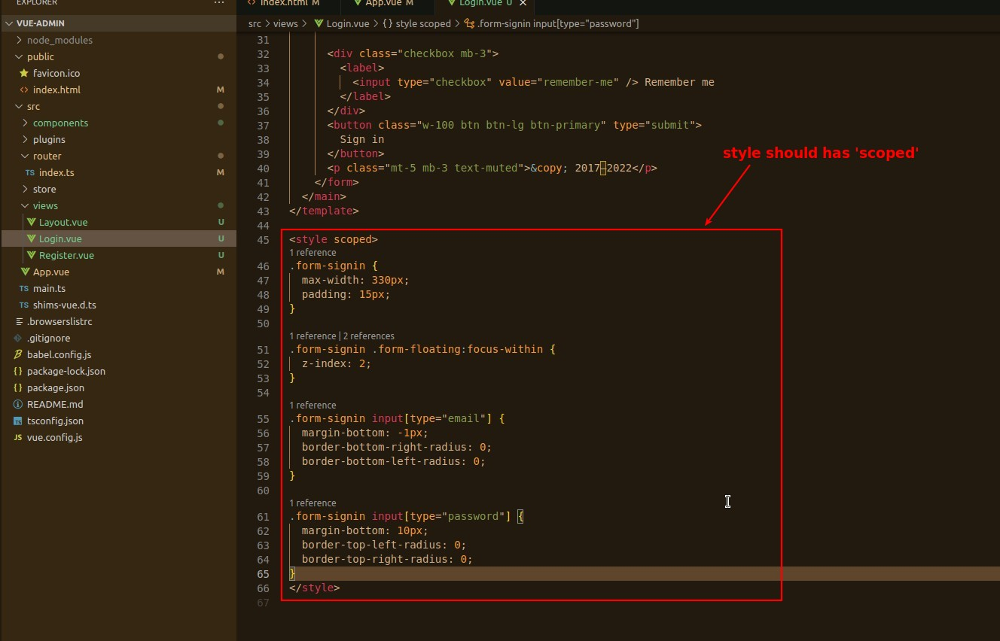

### _Remove/Leaner Template Codes_

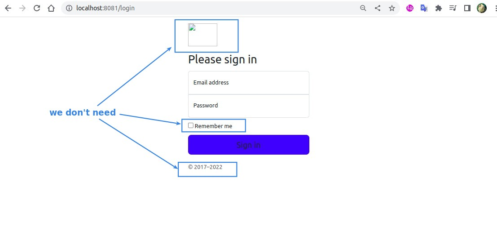

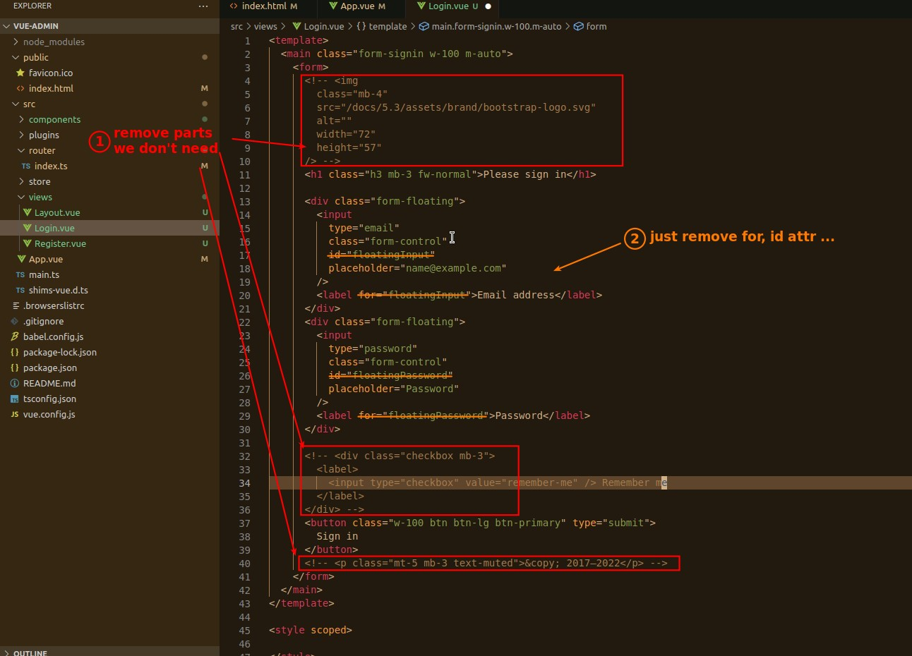

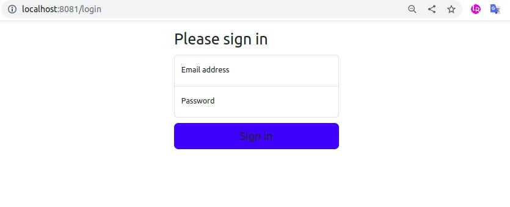

### _About Register_

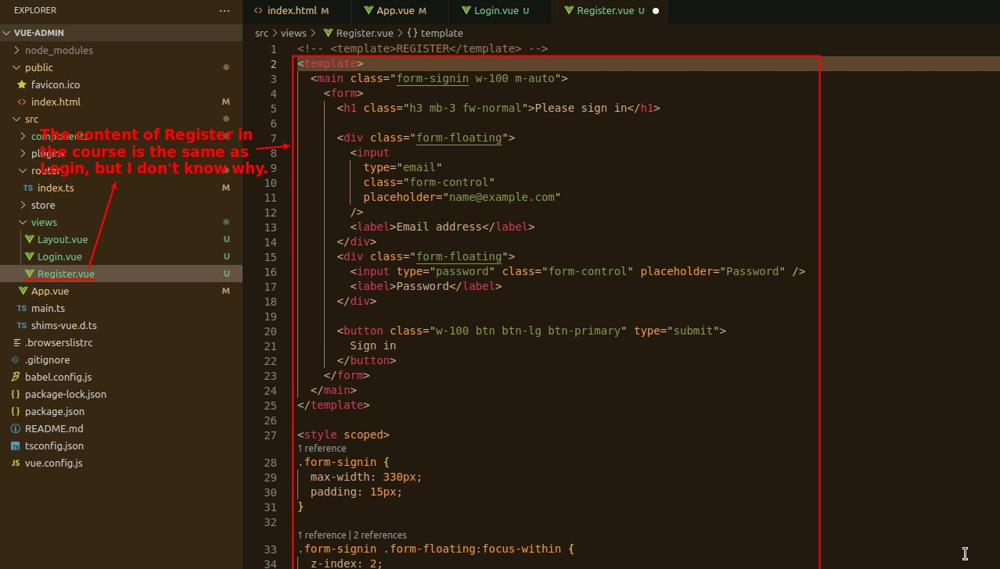
