## **Layout**

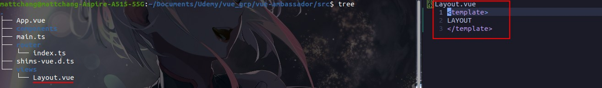

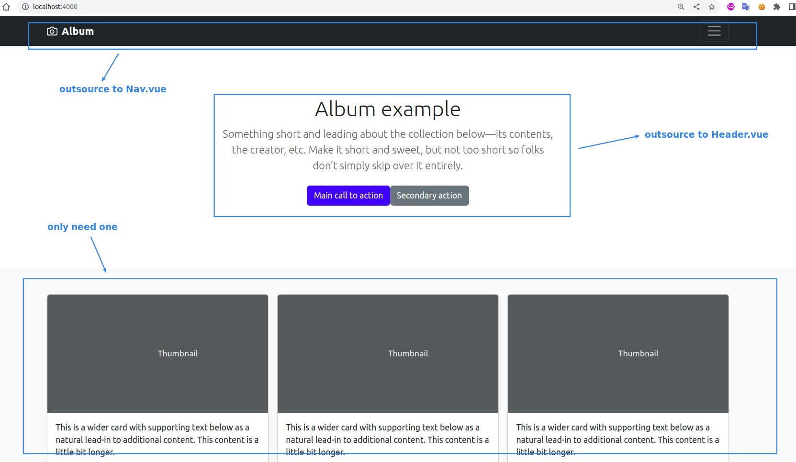

### _Bootstrap CSS install_

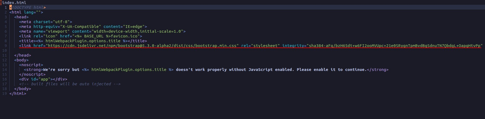

### _Copy paste ALBUM example_

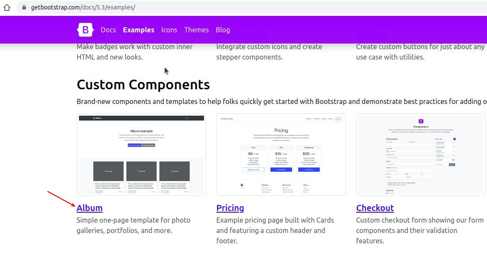

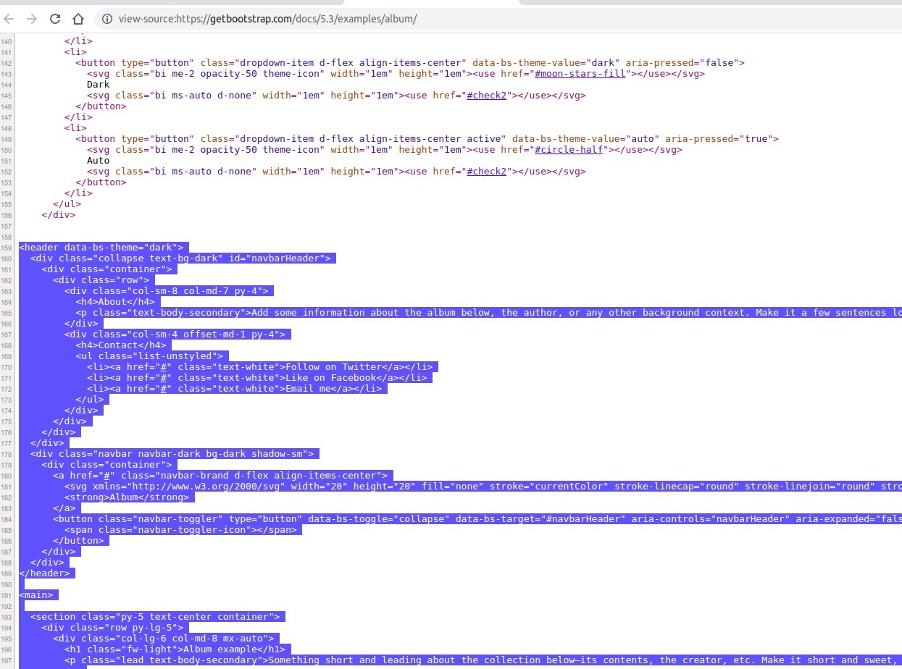

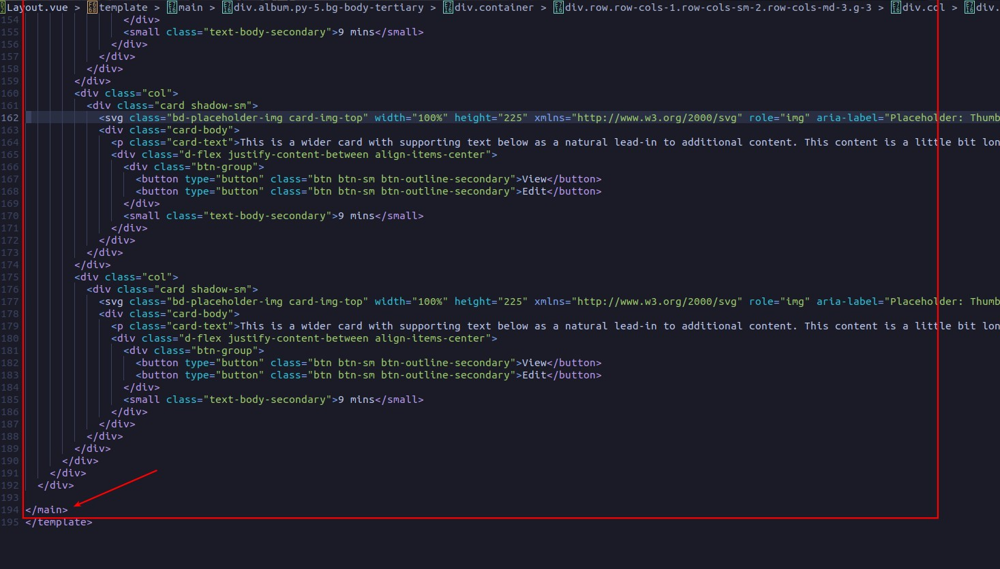

### _Nav_

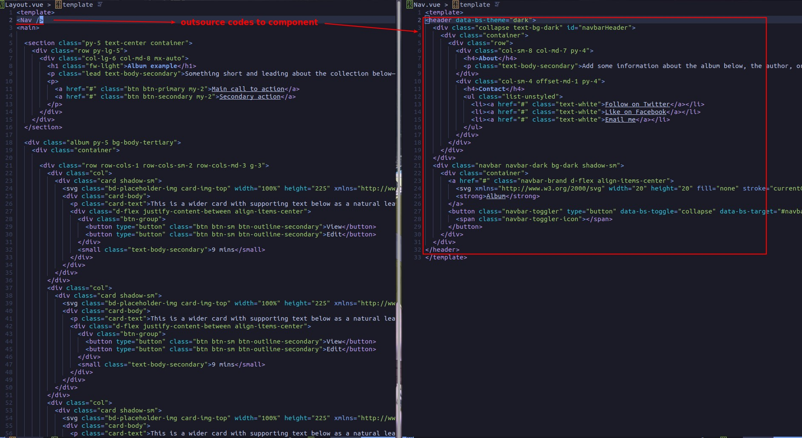

### _Header_

### _Keep only one col_

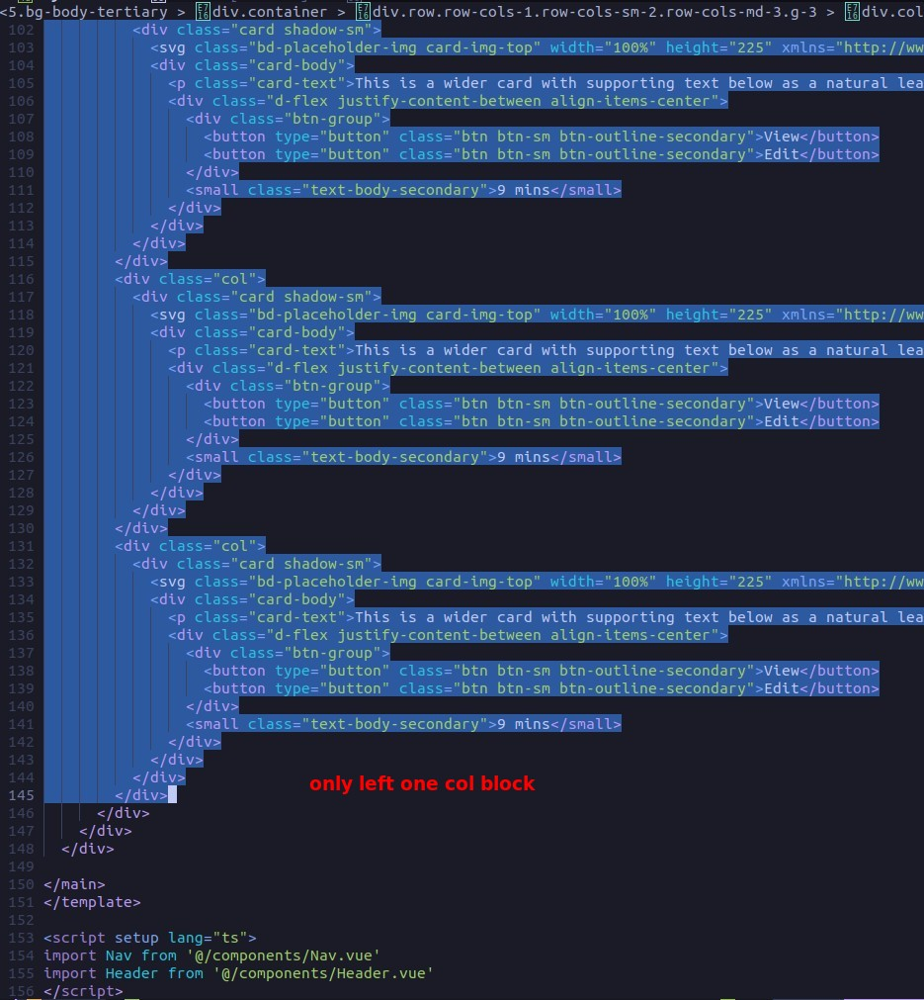

### _result_

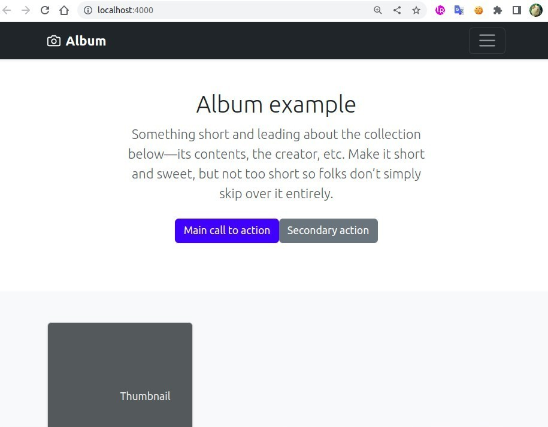

## **Settings**

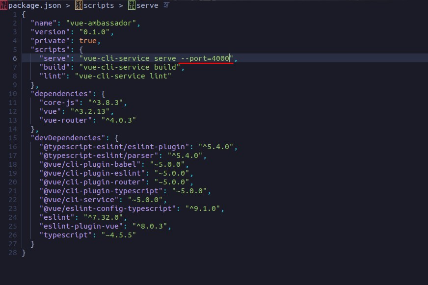

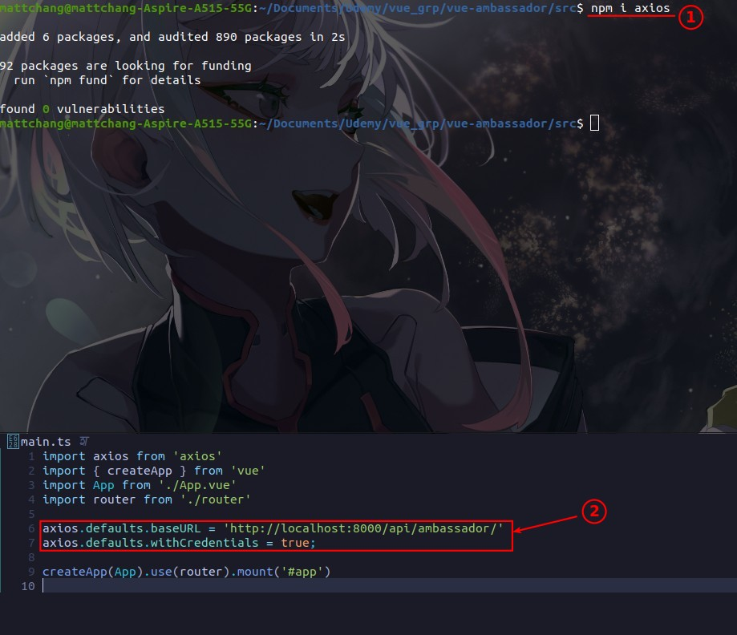

## **Copy Basic pages from other project**

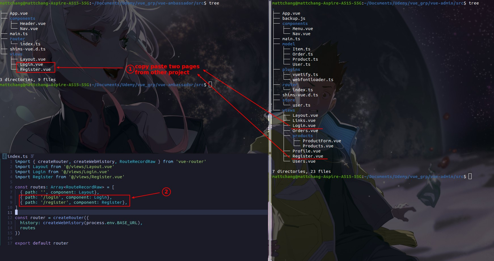
