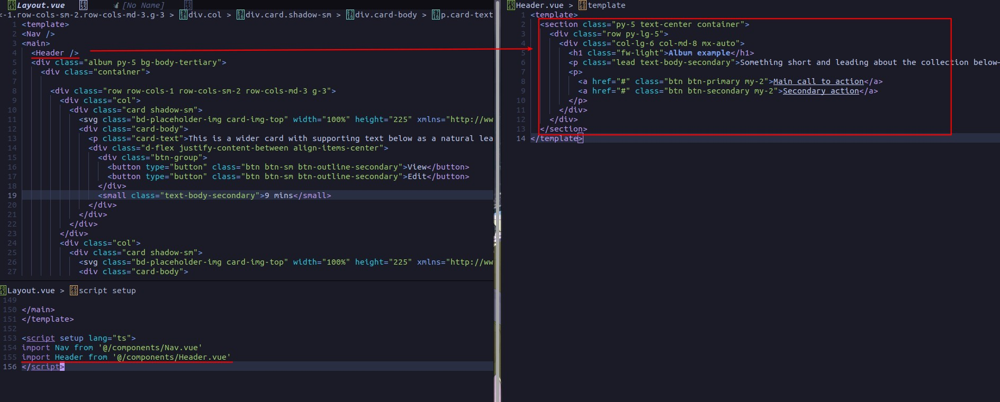

## **Layout**

### _Bootstrap CSS install_

### _Copy paste ALBUM example_

### _Nav_

### _Header_

### _Keep only one col_

### _result_

## **Settings**

## **Copy Basic pages from other project**

