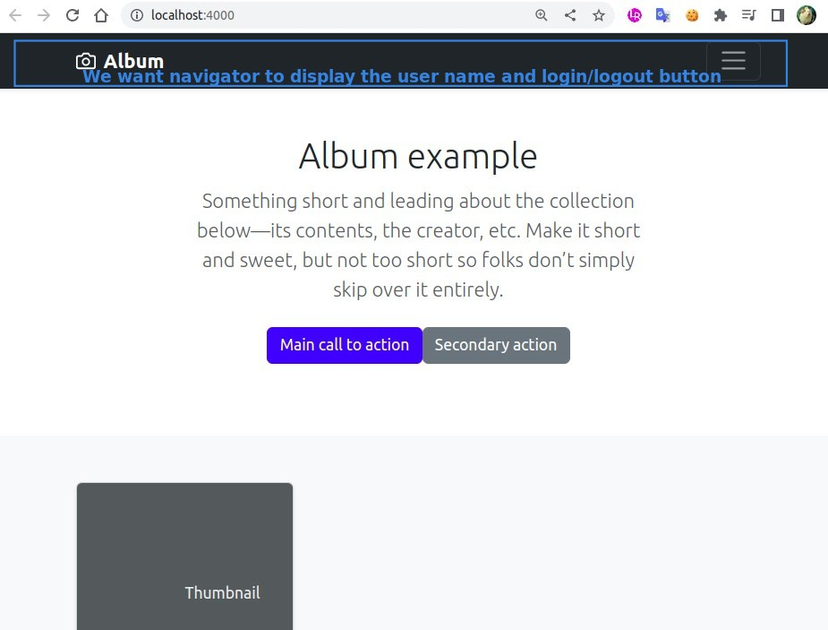
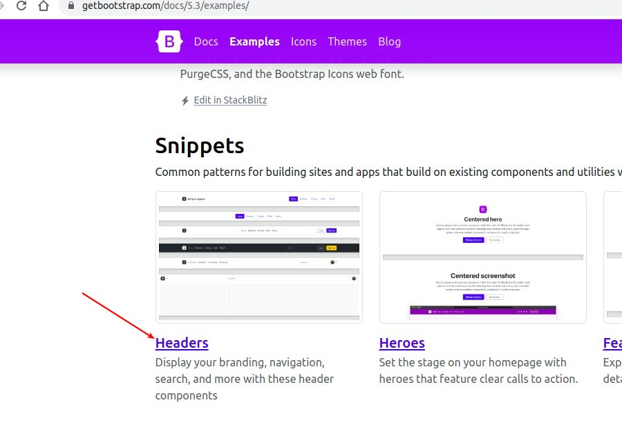
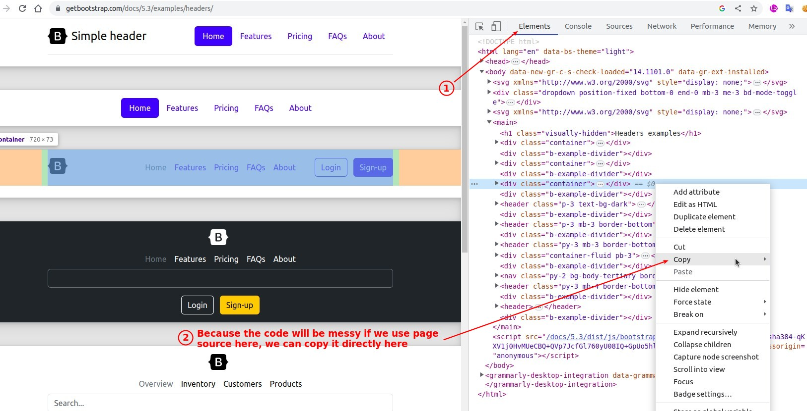
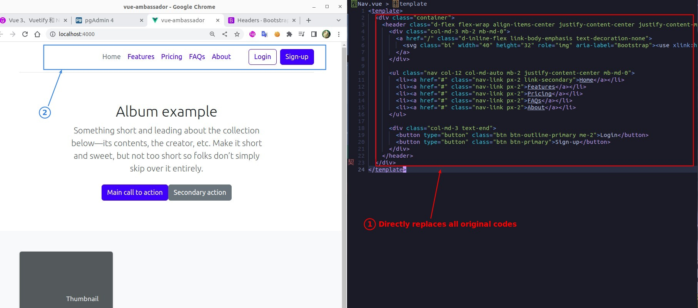
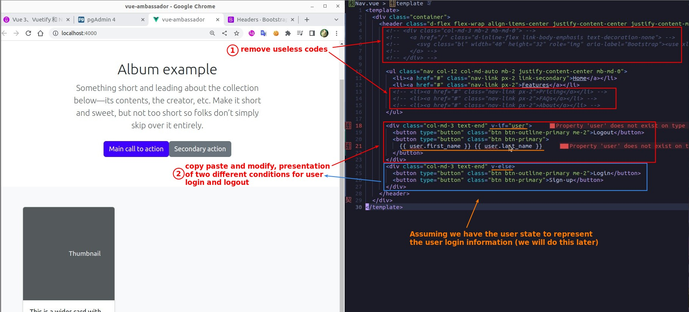
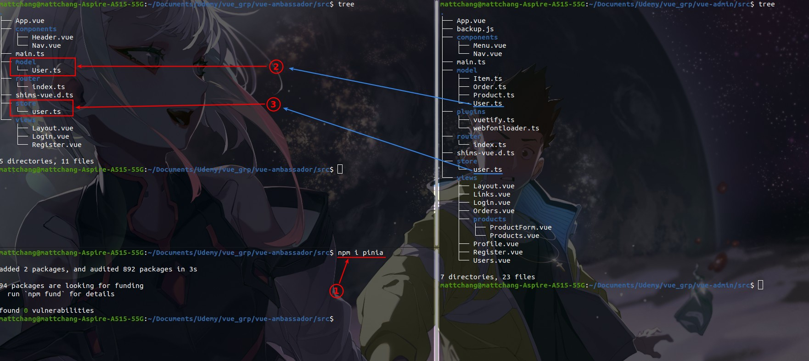
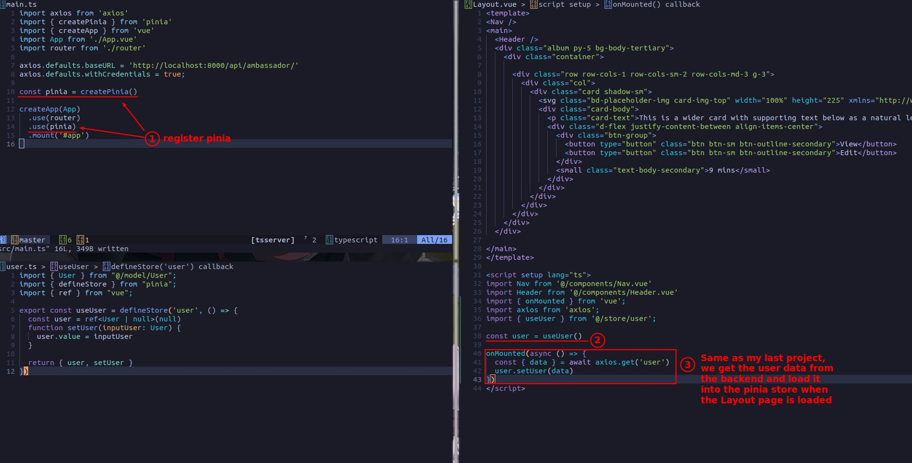
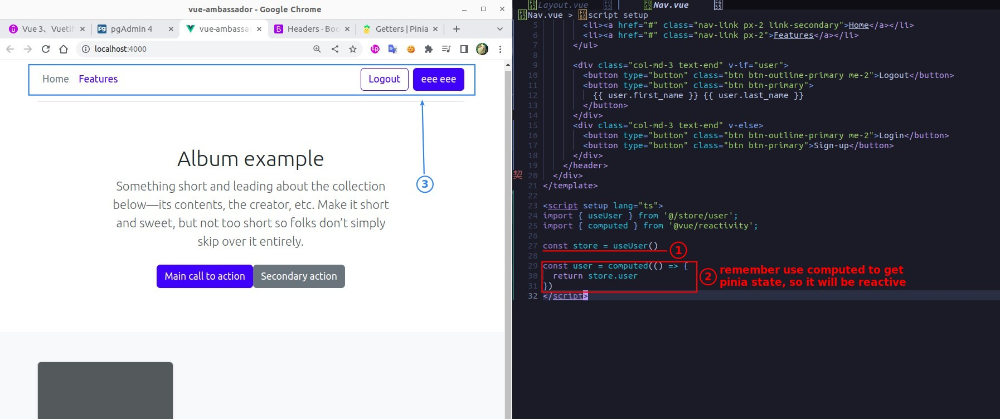

## **Goal**

## **Get Headers from Bootstrap**

## **Edit Template**

## **Migrate Pinia codes from other project**

## **Fetch Backend User data to Pinia store in Layout**

> Because each component can directly access the data and functions in the Pinia store, it is suitable to fetch and set pinia store user data even if the Layout page does not need to use user data.

## **Access User data of Pinia store in Nav**

