## **New Pages setup**

### _create_

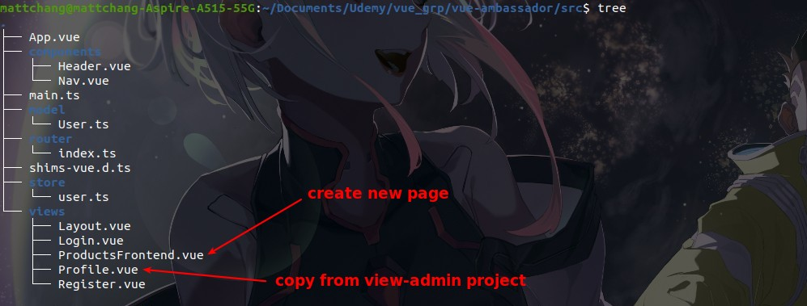

### _migrate codes_

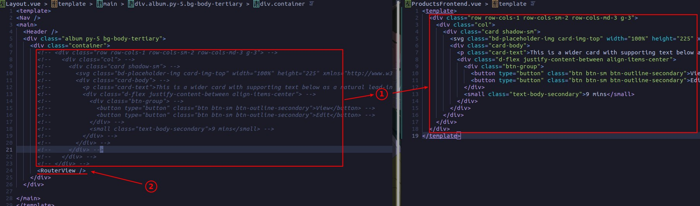

### _routes and navigator_

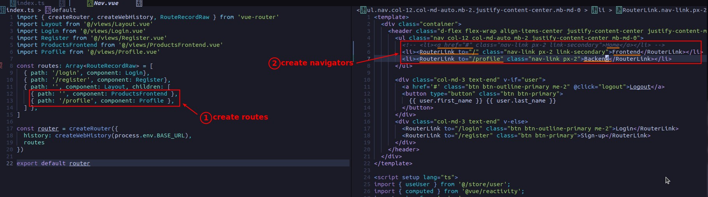

### _TEST_

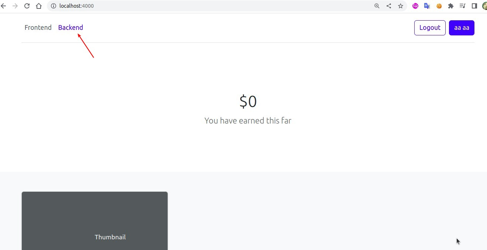

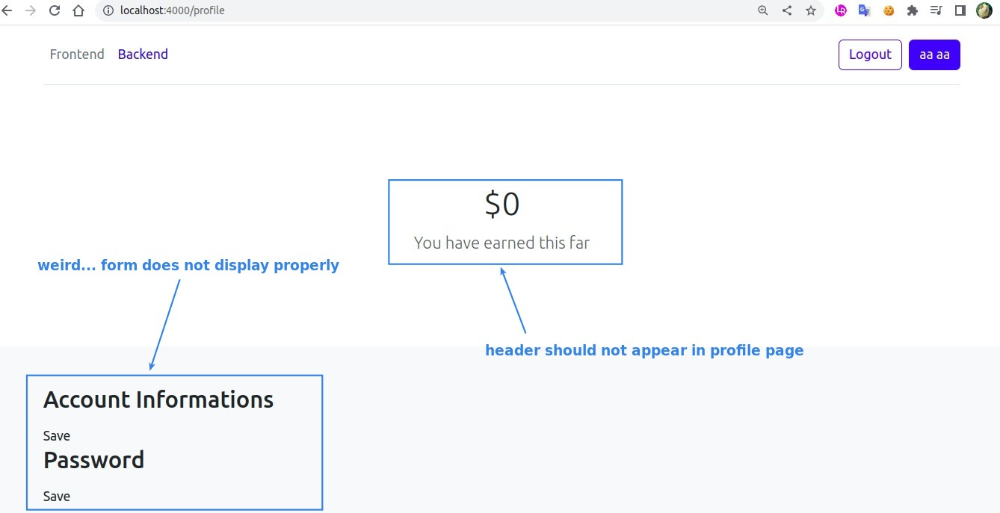

## **Rebuild Profile page**

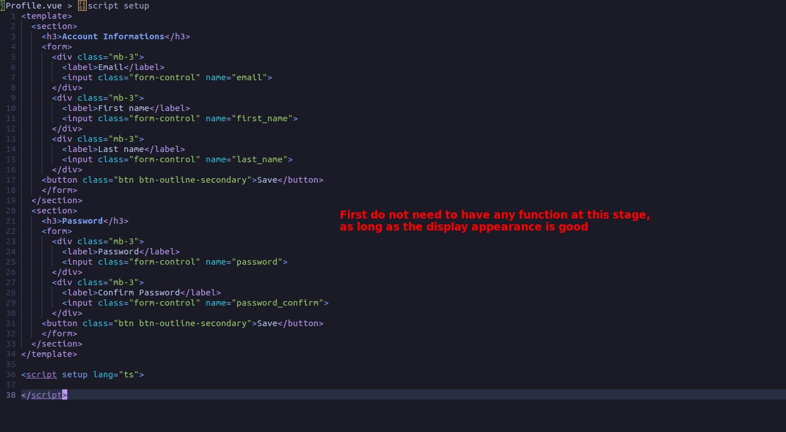

## **Use Route**

### _show Header or not_

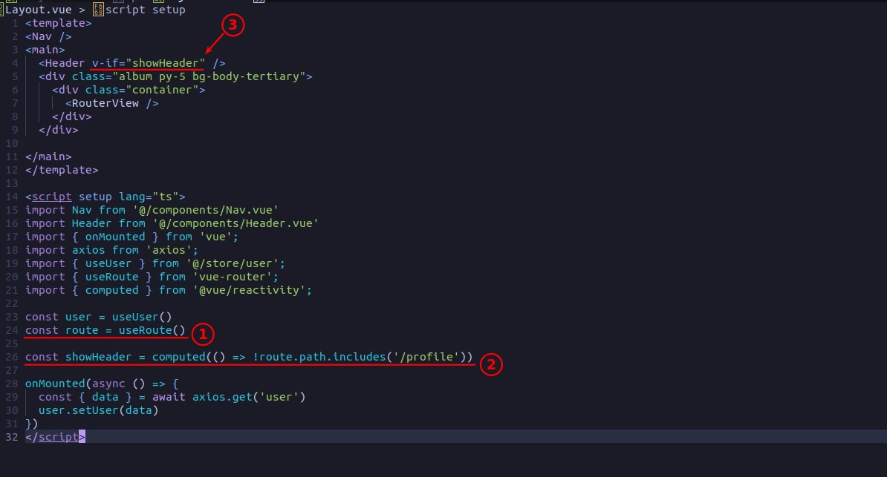

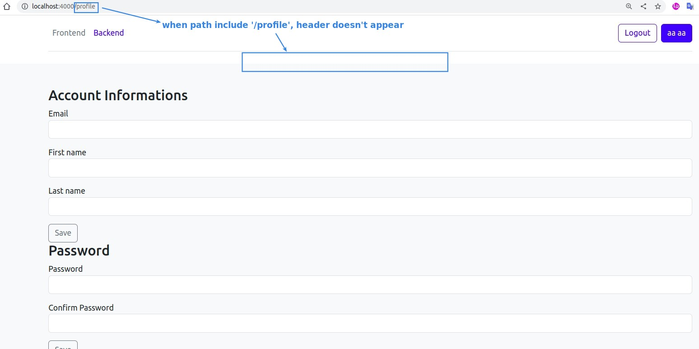

### _toggle class_

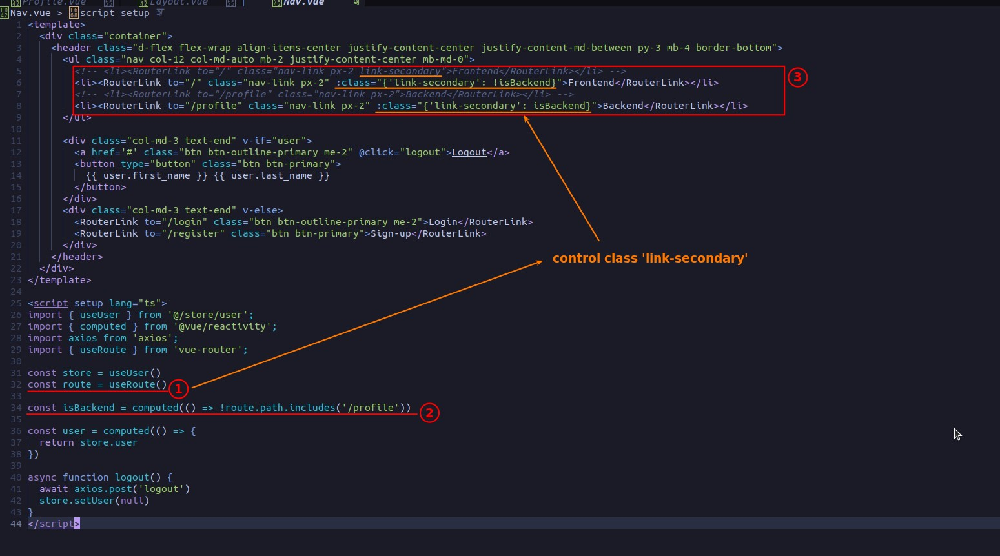

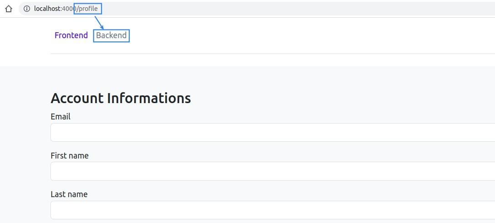

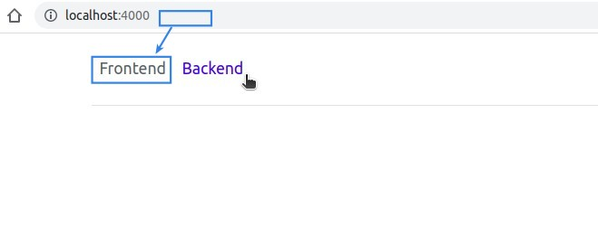
