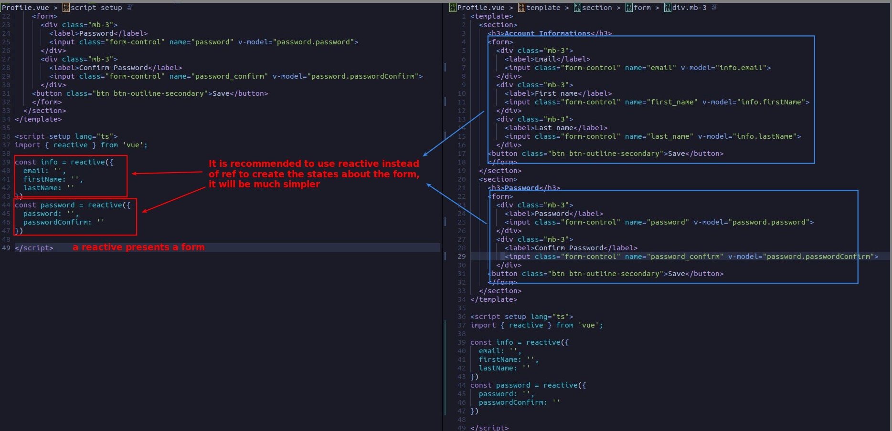
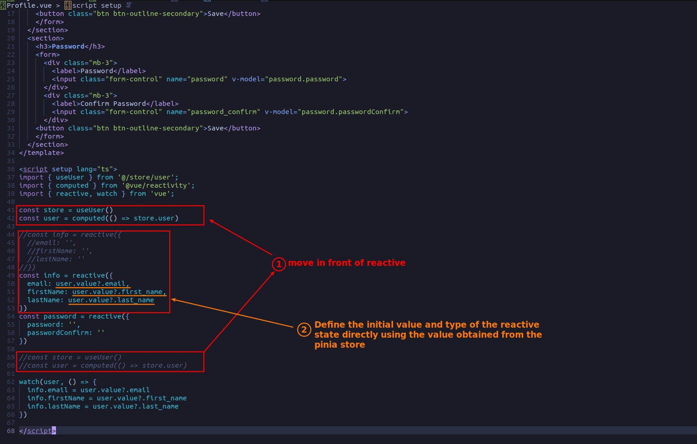
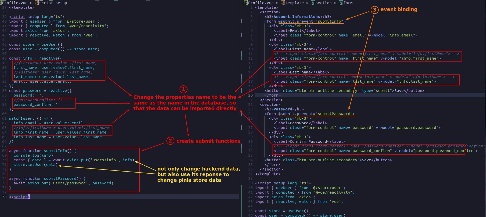
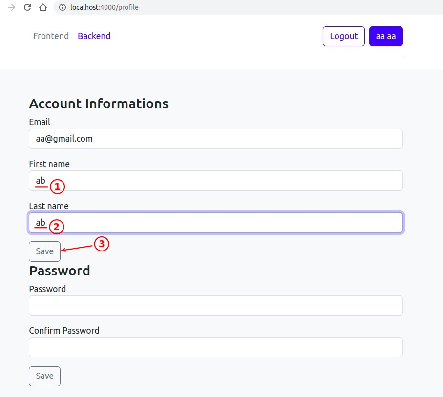
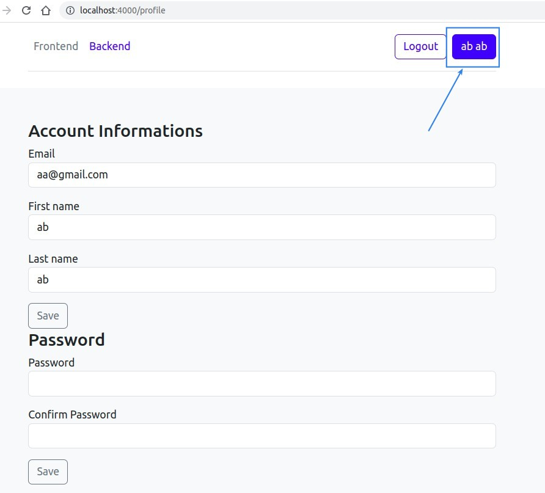

## **Use Reactive instead of Ref for Form**

- In fact, the property names used by the object in reactive should preferably be the same as those in the database, and we will see why later.

## **Get user data from pinia store**

- Typescipt will define the type based on the initial value given, so we don't need to define the type of each property in reactive, but just give the initial value.

## **Change state names**

- This is why it is better to have the same property names in reactive as in the database.

## **TEST**

