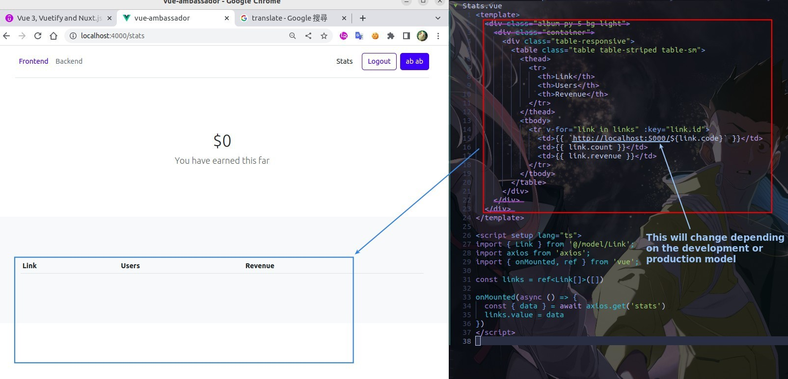

## **Goal**

## **Create/Register New Page**

## **Navigator and Fetch data from database**

## **Model of Link**

## **Stats.vue block**

### _stats_

### _template_

## **Environment variable**

## **Prevent TheHeader present**

