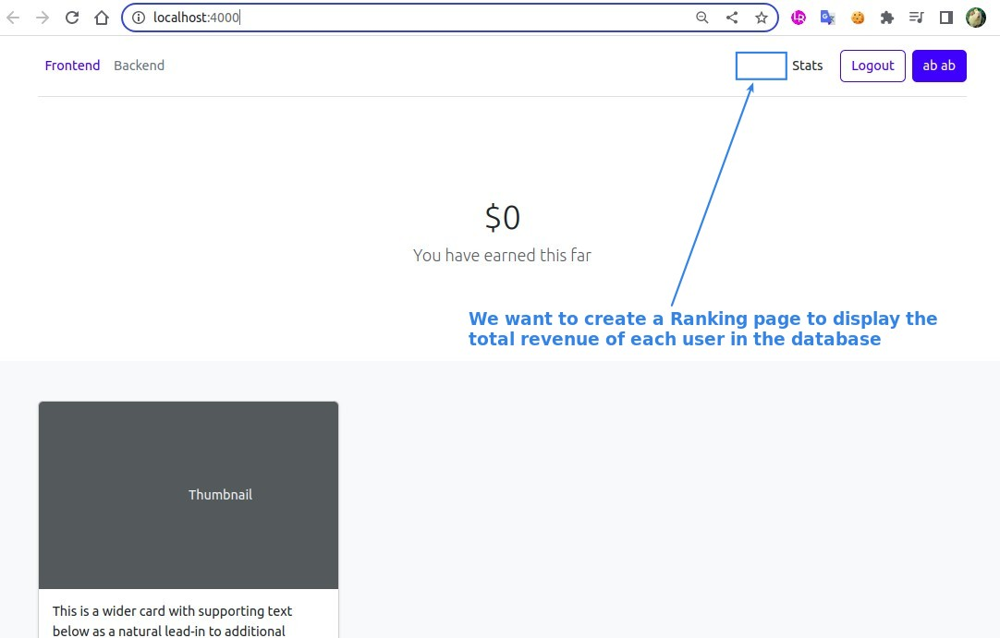
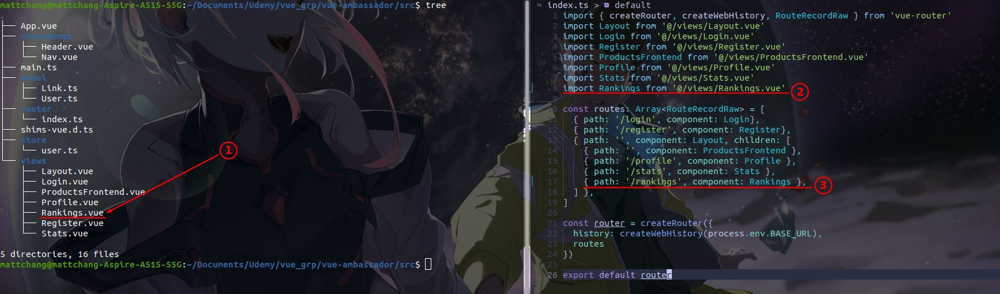
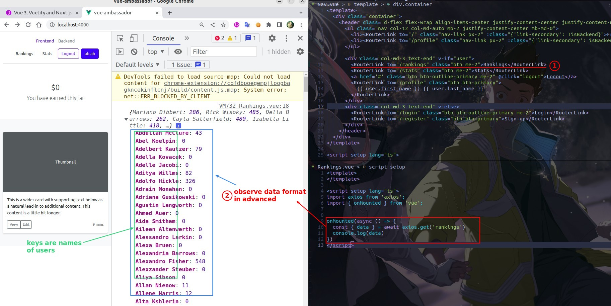
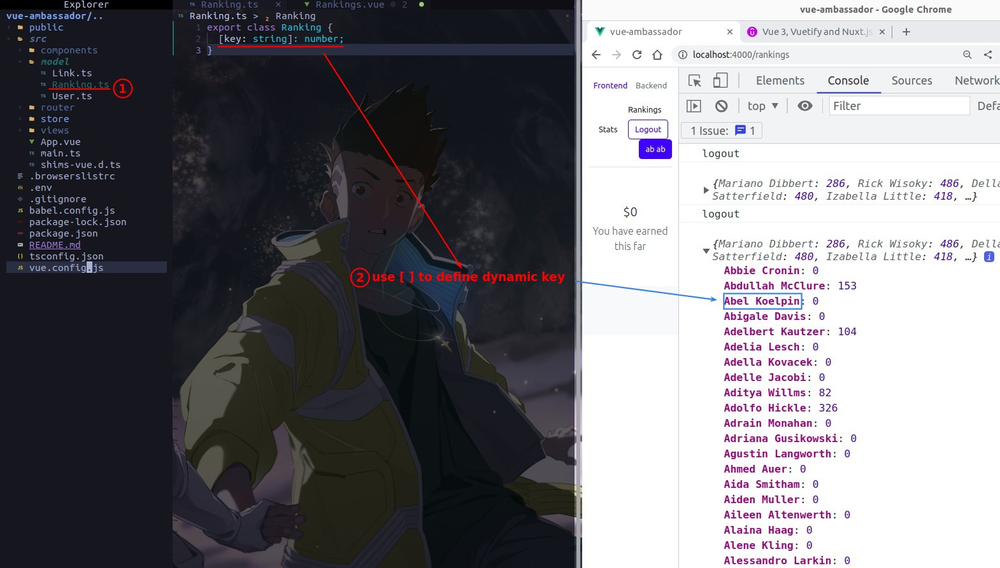
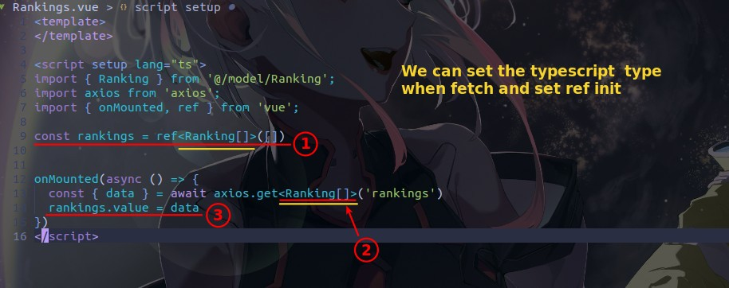
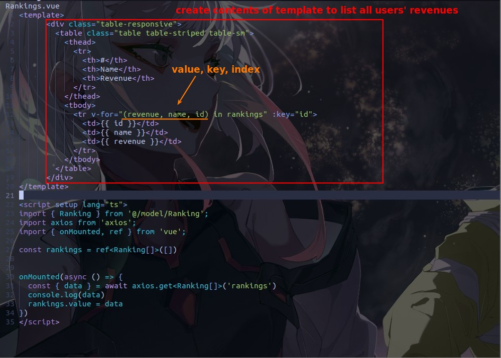
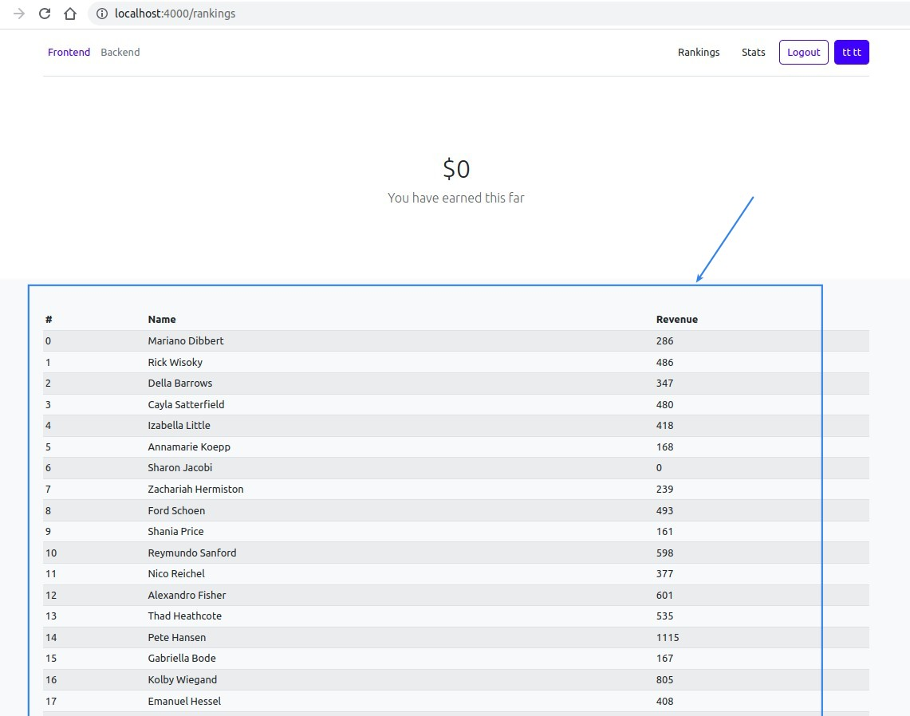
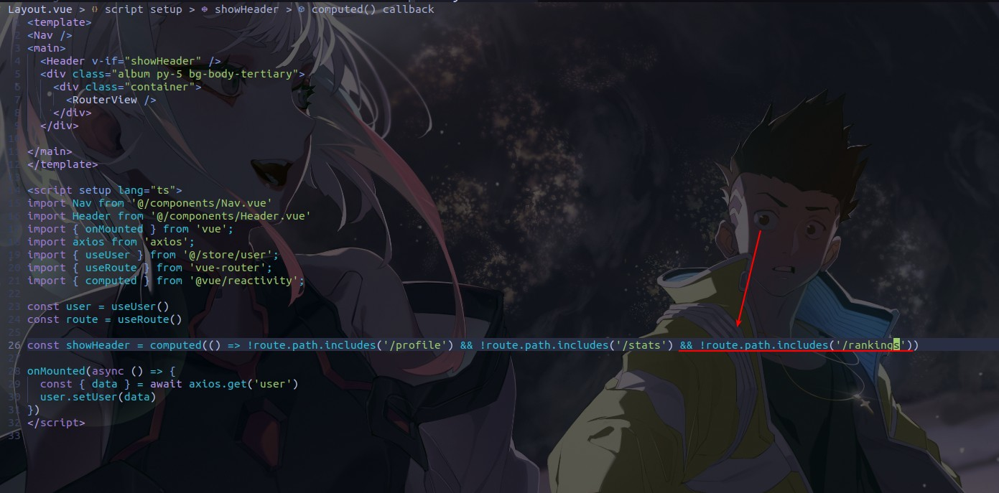
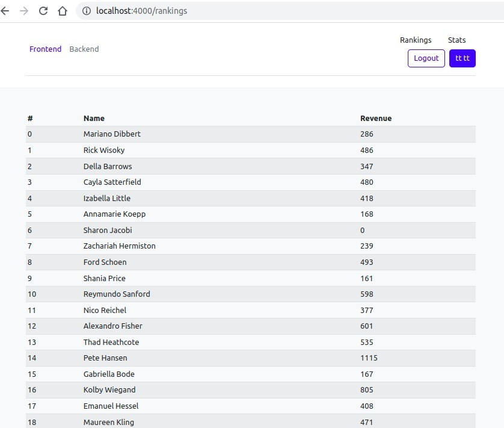

## **Goal**

## **Create/Navigator of Rankings page**

## **Model of Ranking**

> When our key is a variable, the model is defined in a special way.

## **Multiple params of v-for**

> v-for can not only iterate value, but also the key and index.

## **Remove TheHeader**

