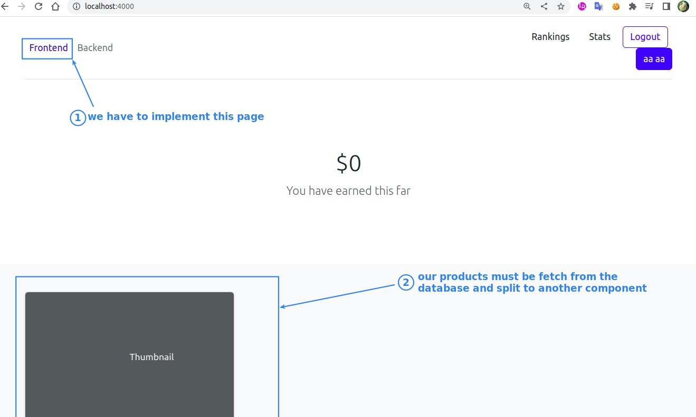
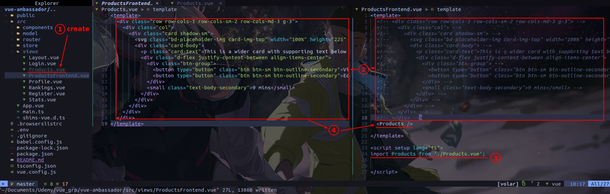
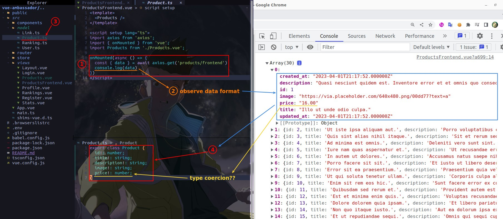
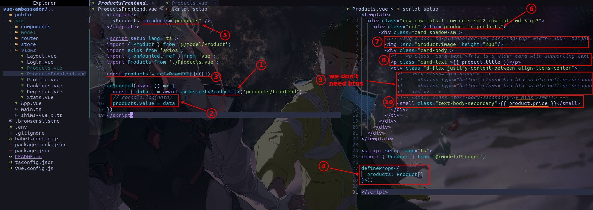
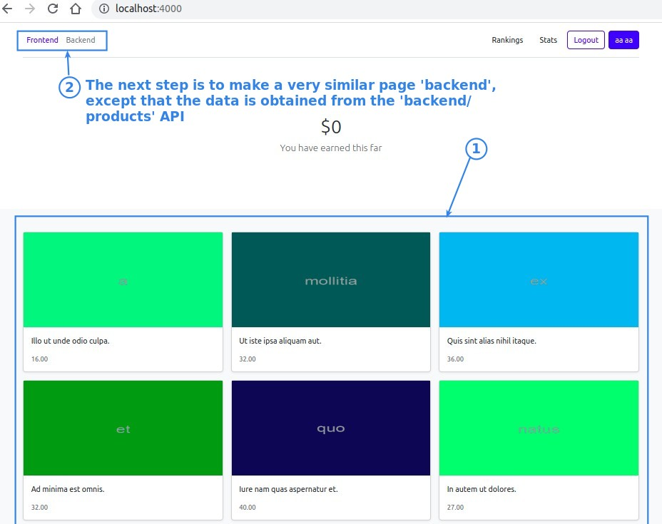
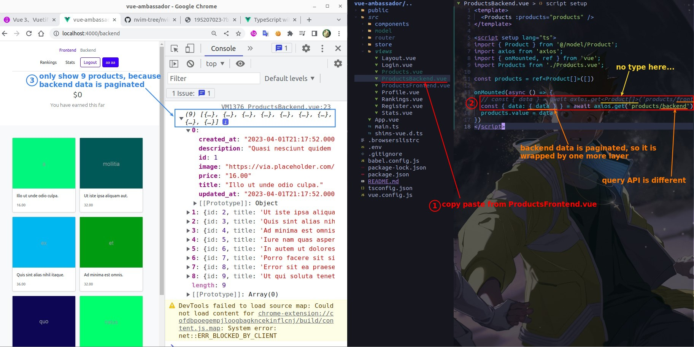
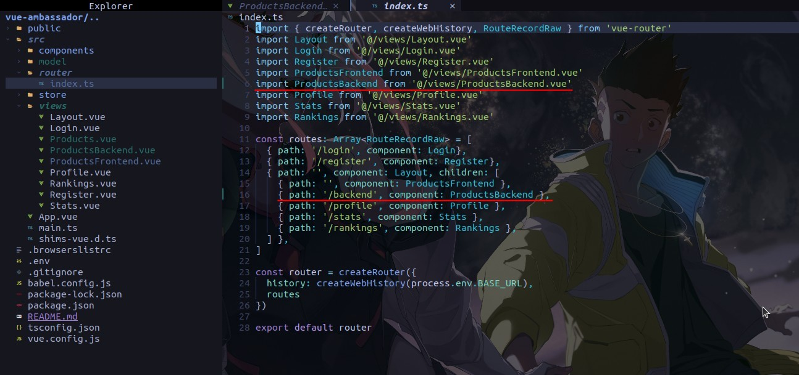
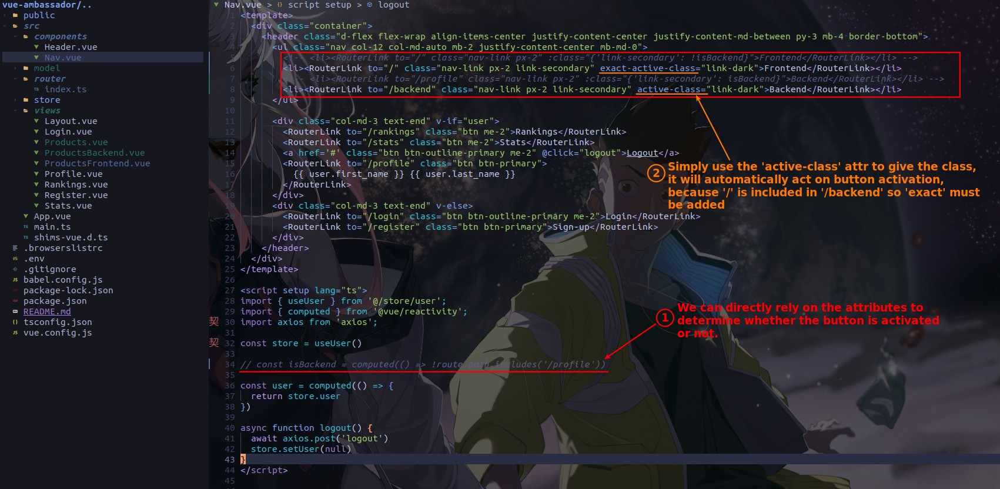
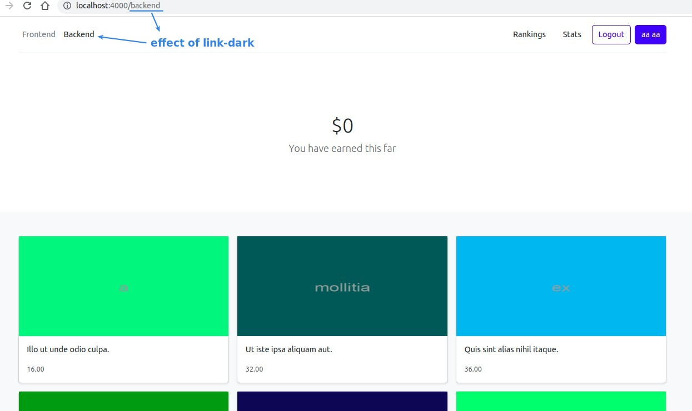

## **Goal**

## **Products.vue**

- Actually, I think if Products.vue doesn't use 'RouteView', it should be in the folder 'components'.

## **Fetching and Modeling**

## **Building state and Propogation**

## **Backend page**

> The backend page is almost the same as the frontend page, the only difference is the API used, and the data retrieved is paginated.

## **Navigators**

> Previously I used the Route object to determine if the button was used, but there is a simpler way.

