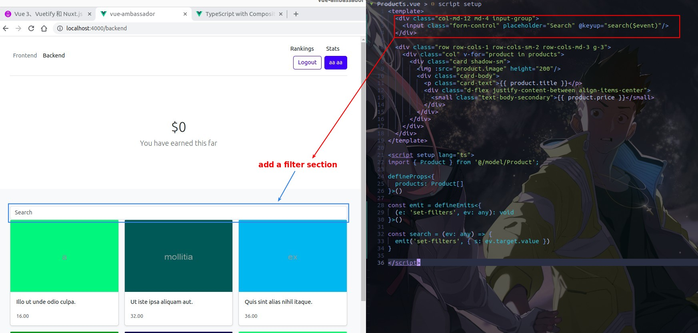
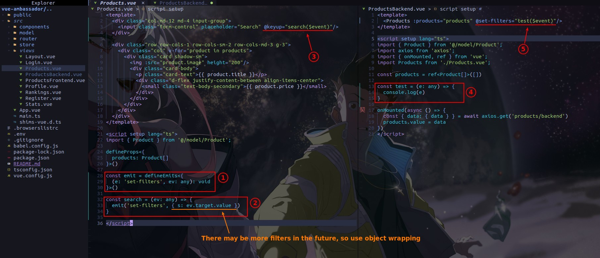
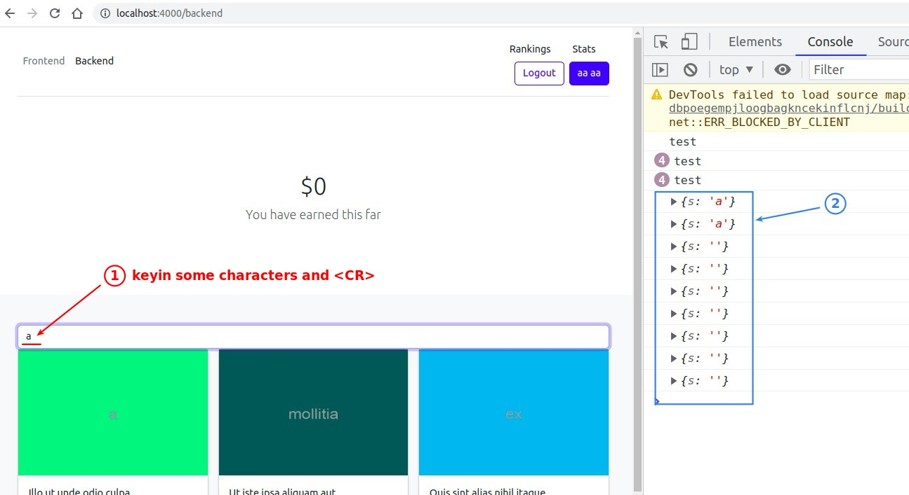
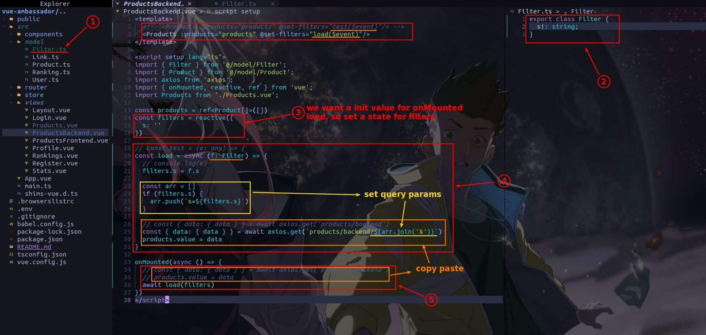
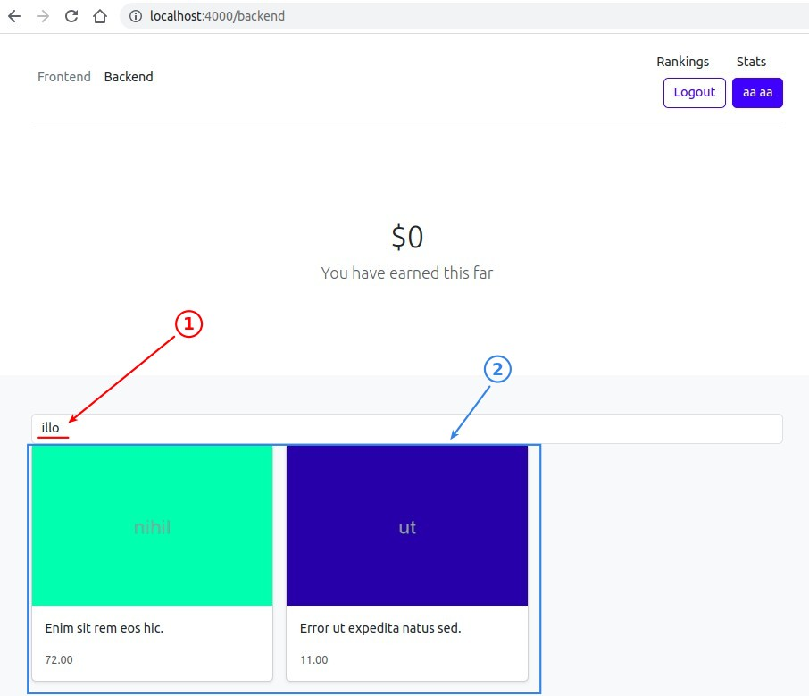
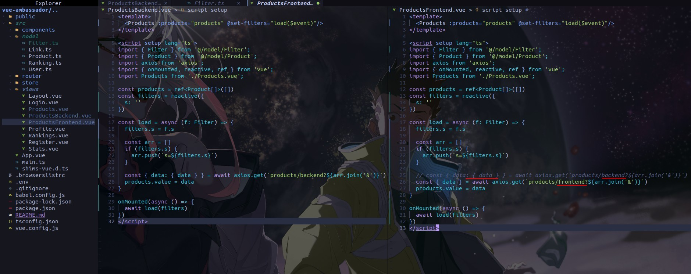

## **add Search frame (template)**

## **Emit custom event and Test**

## **Catch custom event and create handler for it**

- The load function is a query based on the value in the state 'filters', rather than a direct value from the custom event.

## **Copy paste codes to frontend page**

- Note that the red part is the difference between the front and back ends.
