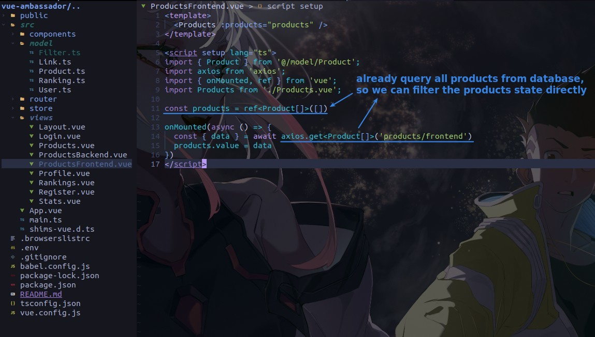
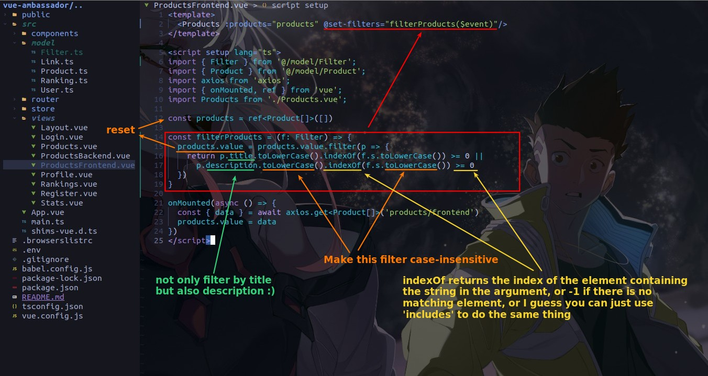
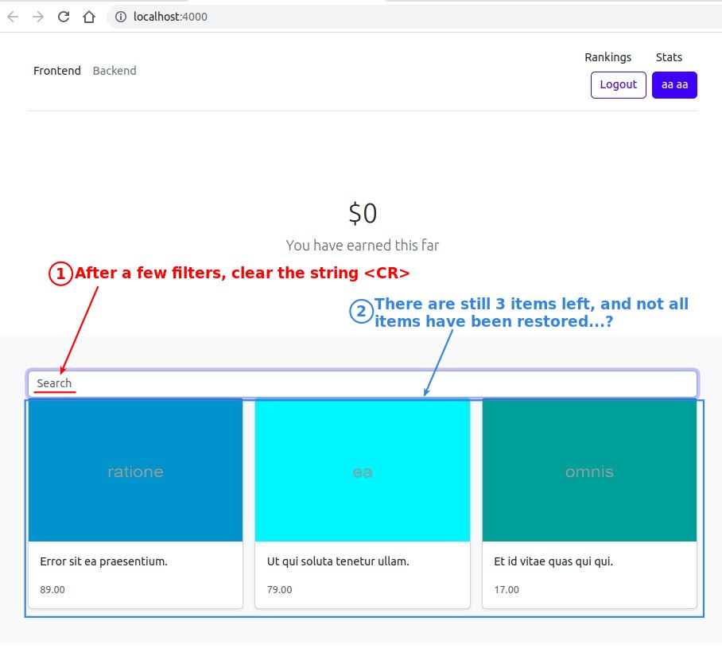
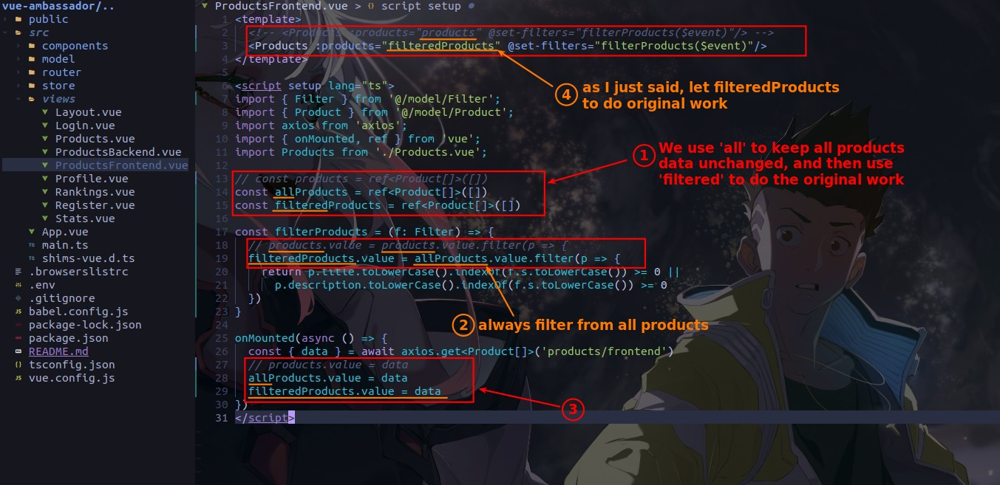
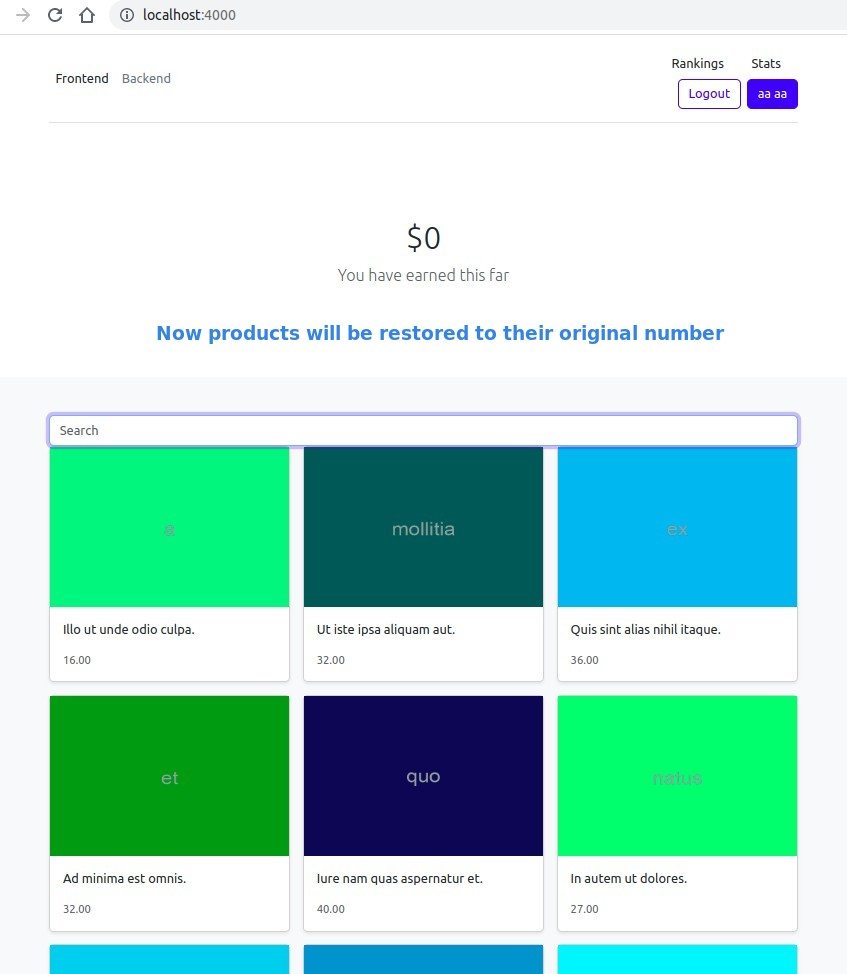

## **Analyze the difference between front-end and back-end filtering**

- The backend is filtered using the API's query parameter, but the frontend doesn't need to do that.

## **Directly filter the products state and reset it**

- Each time we filter the state 'products' there will be less products, and they will not be restored, which is obviously not the result we want.

## **Change to two products states instead of one**

> We use one state to store all products data, and another state to store filtered products data.

- The main point is that in step 2, each filter is done with all products, so there is no problem of less and less product data being stored in state.

