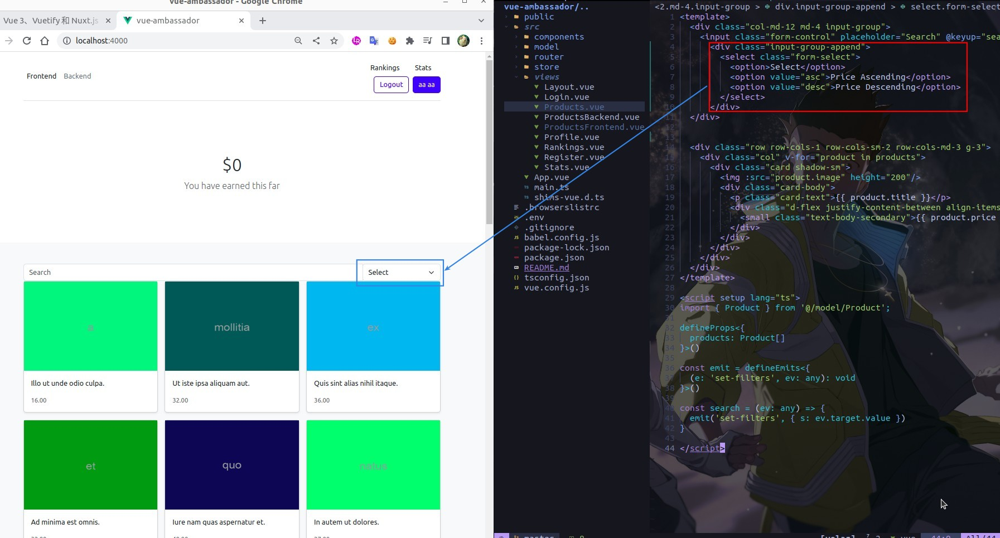
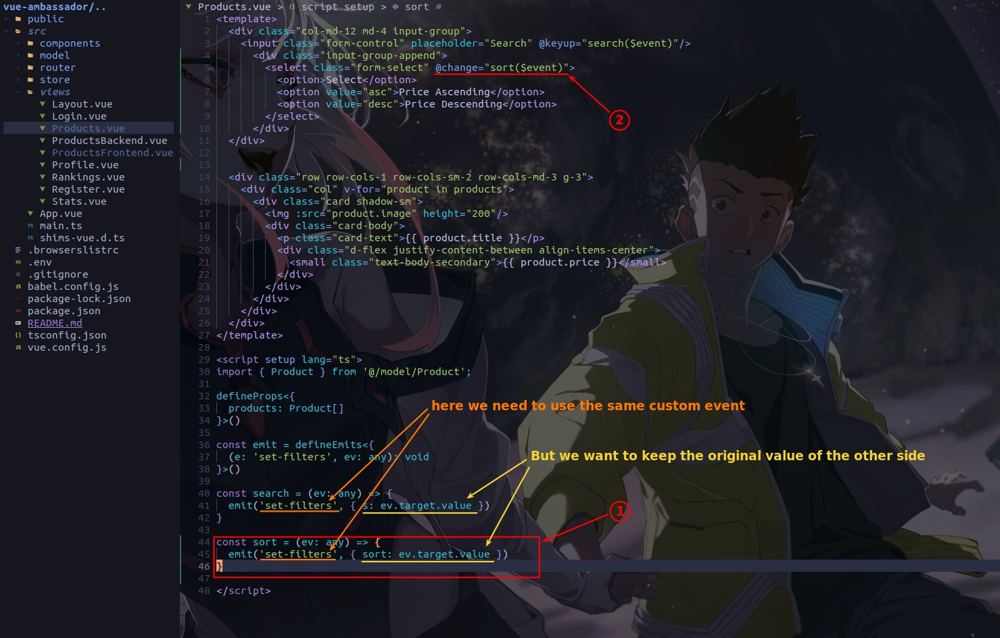
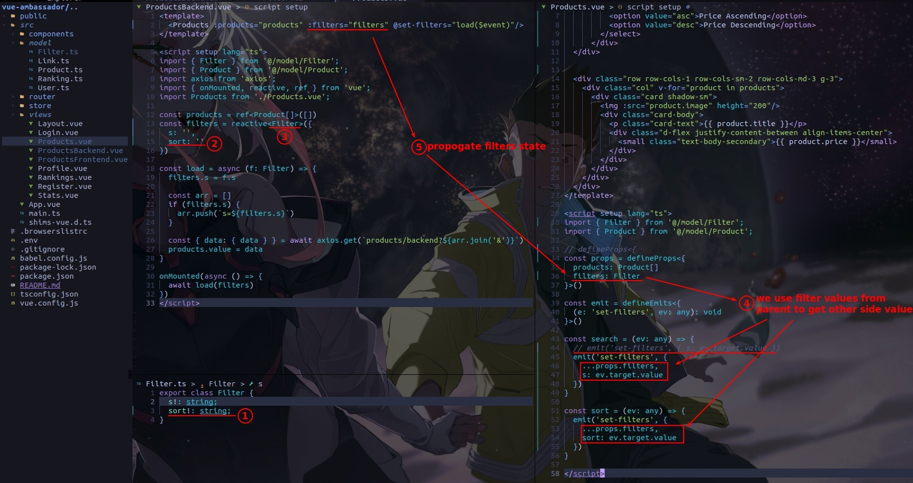
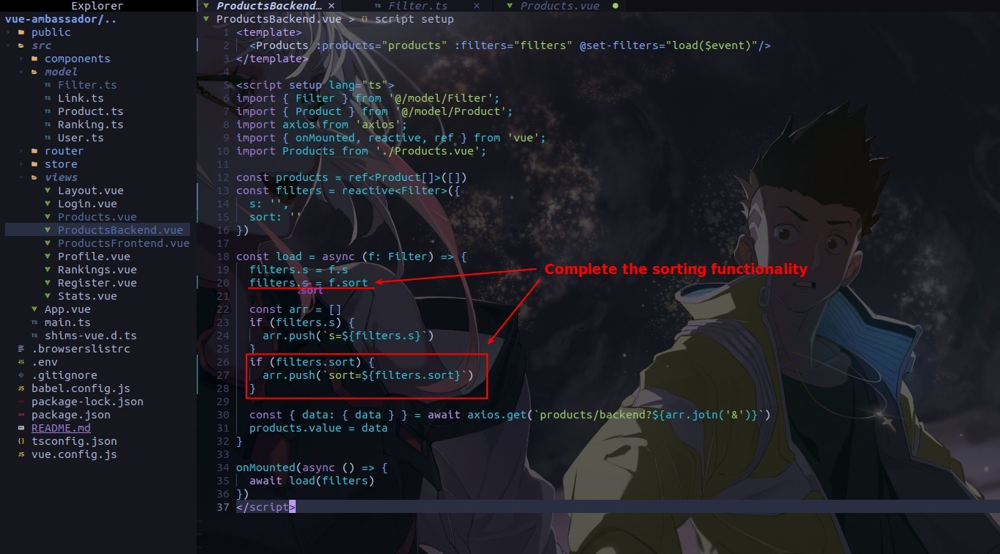
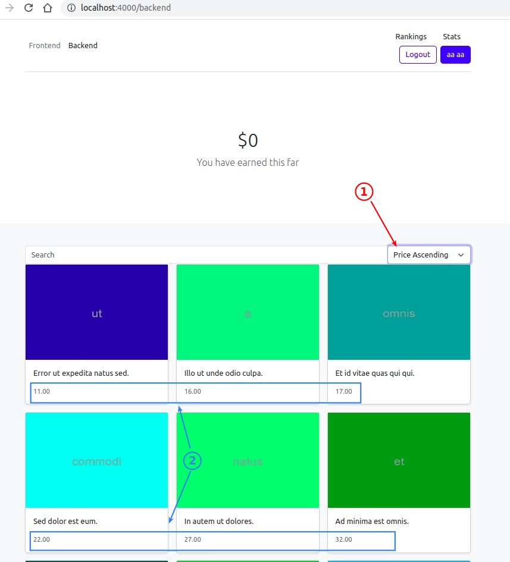

## **Add Select in template**

## **Emit sort request with the same custom event as search**

> Because searching and sorting are handled in the same query, the same custom event must be used to send both requests so that they are handled by the same handler function in the parent component.

- The emit payload part of the codes above only sends 's' or 'sort' data on one side, the other side will automatically become undefined, which is not what we want.

## **Propogating filters value from parent**

> We store the 's' and 'sort' values of each query in the parent component, so that they can be used by the child component.

## **Complete the sorting functionality**

