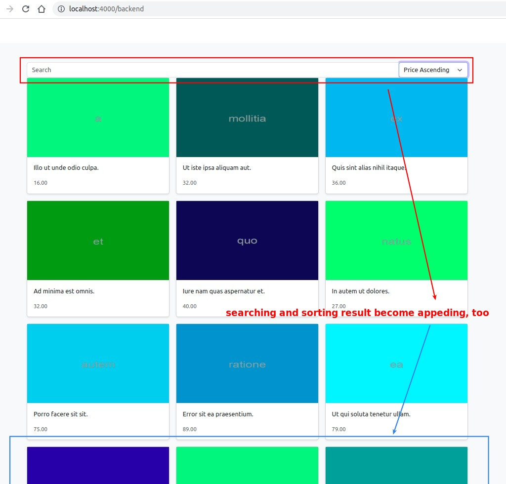

## **Add Load More btn (Template)**

## **Event Handler of Load More btn**

## **Add 'page' property to model and query parameter**

## **Problem: Not cumulative, but simply change page...**

## **Problem: Sorting and Searching become cumulative, too...**

