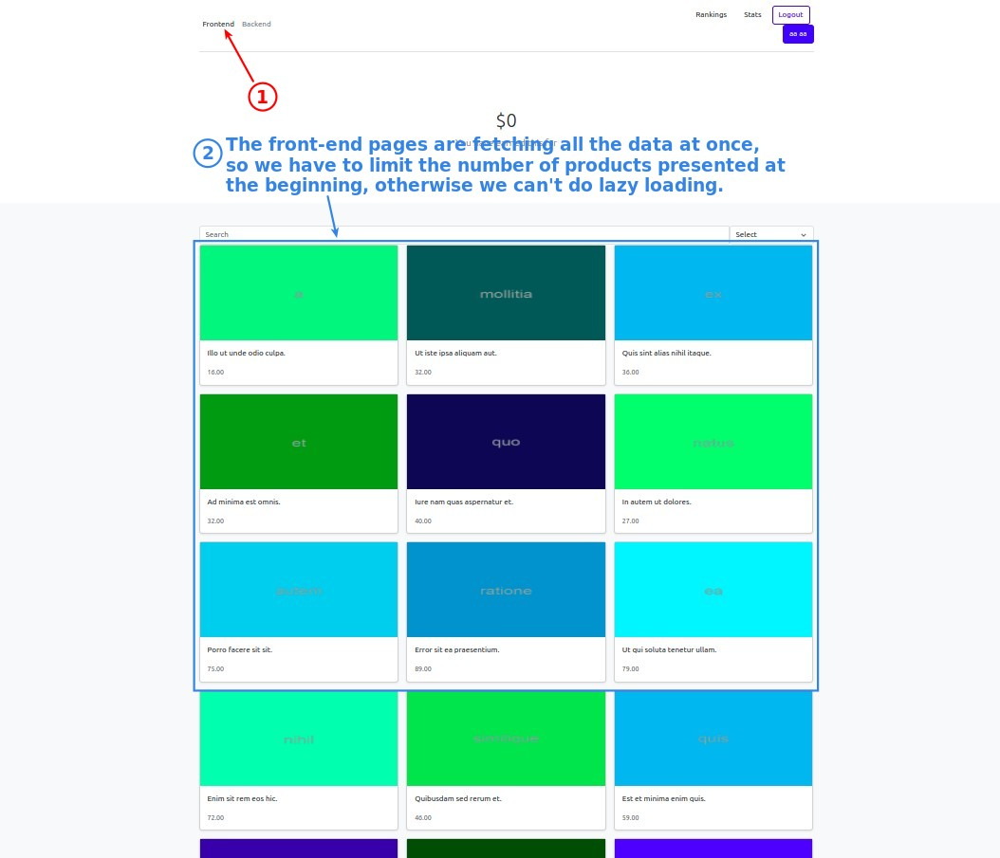
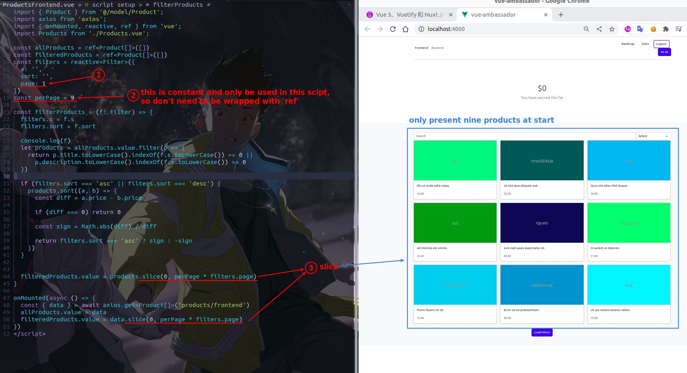
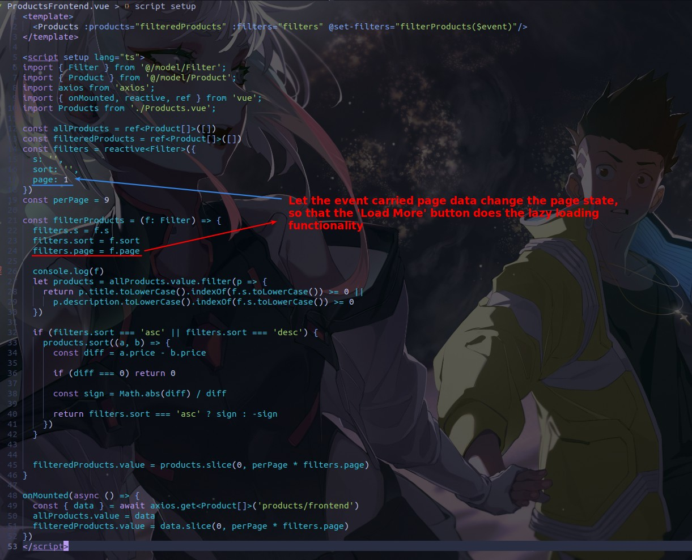
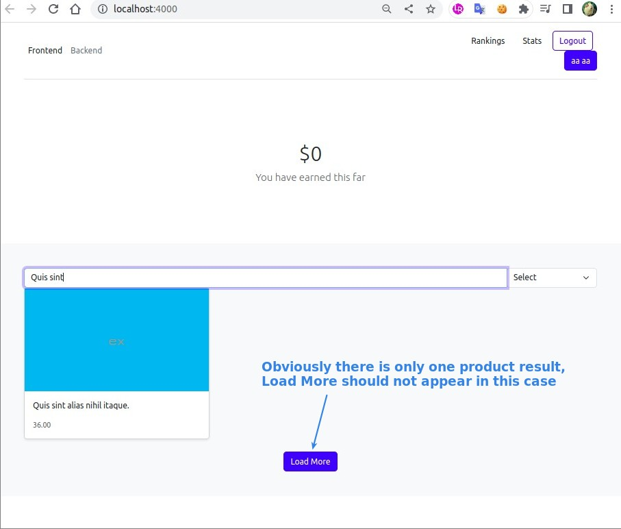
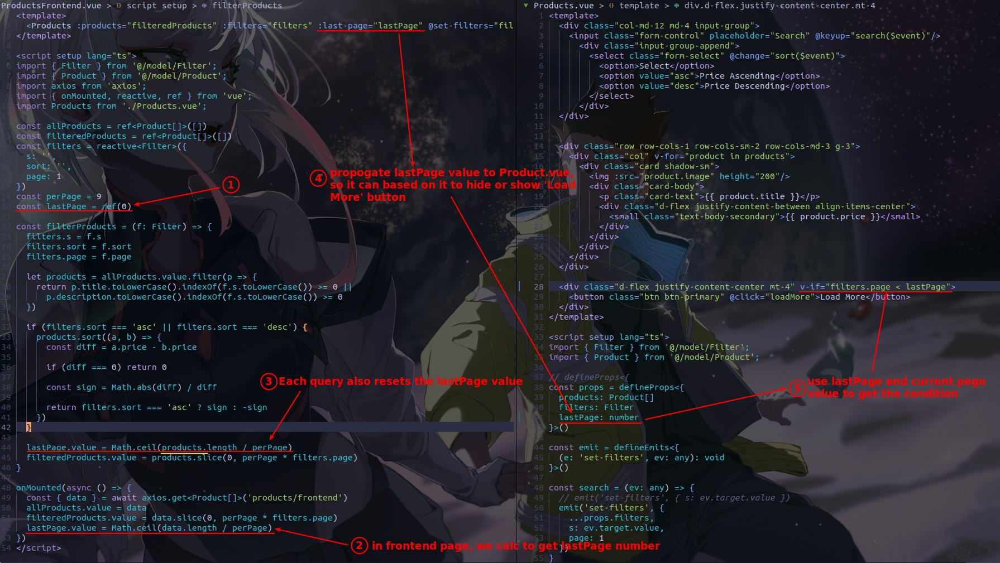
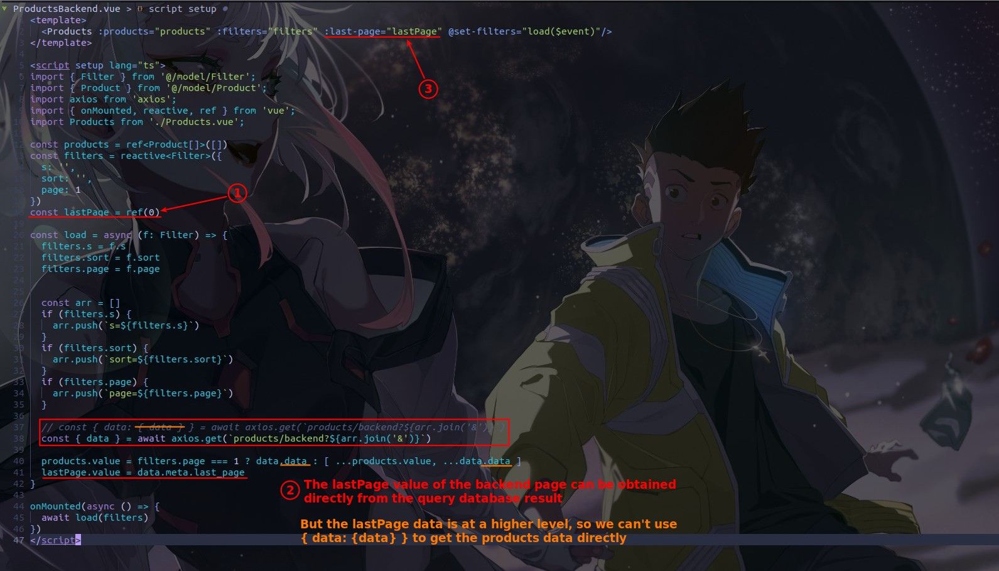

## **Goal: Lazy loading of frontend page**

## **Limit presented products by slice method**

- So far, the 'Load More' button is not working, the page will always remain 1, so only 9 products can be displayed.

## **Dynamic change 'page' state with event payload**

> Simply reset the state page using the data carried by the emit event of Products.vue to enable the 'Load More' button.

## **Goal: Hide the 'Load More' button**

### _frontend page_

> We must calculate the last page ourselves.

### _backend page_

> The value of last page is provided in the result of the API response directly.

